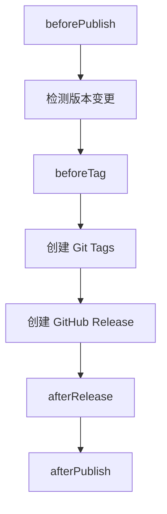
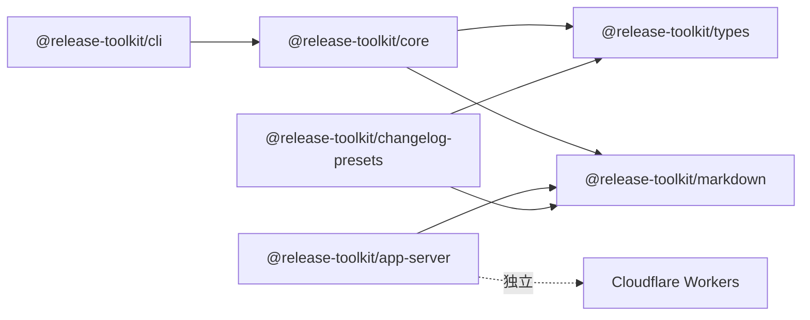

# Release Toolkit

CI 驱动的 **Monorepo 发布工具链** —— 自动收集 PR 变更日志、聚合版本发布、创建 GitHub Release。

## 整体流程

```mermaid
flowchart TD
    subgraph PR阶段
        A[PR → dev] --> B[prLogCollector]
        B --> B1[提取 PR 标题 + 评论日志(特定格式截取)]
        B1 --> B1a[PR 被 Approve]
        B1a --> B2[更新 PR 描述体]
        B2 --> B3[保存快照到 .release-toolkit/releases/]
    end

    subgraph 预览阶段
        C[PR → dev] --> D[releasePreview]
        D --> D1{检测版本变更?}
        D1 -->|有变更| D2[聚合日志 + 评论预览]
        D1 -->|无变更| D3[评论无版本更新]
    end

    subgraph 发布阶段
        E[PR 合并到 dev] --> F[releasePublisher]
        F --> F1[beforePublish 钩子]
        F1 --> F2[beforeTag 钩子]
        F2 --> F3[创建 Git Tags]
        F3 --> F4[创建 GitHub Release]
        F4 --> F5[afterRelease 钩子]
        F5 --> F6[afterPublish 钩子]
    end

    B3 --> C
    D2 --> E
    D3 --> E
```

## 生命周期钩子

### releasePublisher 钩子

发布流程中可插入自定义逻辑的关键节点：



| 钩子 | 触发时机 | 用途 |
|------|----------|------|
| `beforePublish` | 发布流程开始前 | 预检查、构建验证 |
| `beforeTag` | 创建 Git Tag 前 | 自定义 tag 格式、额外校验 |
| `afterRelease` | GitHub Release 创建后 | 部署到 CDN、发送通知 |
| `afterPublish` | 全部发布完成后 | 清理、统计、总结 |

### prLogCollector 钩子（插件）

| 钩子 | 触发时机 |
|------|----------|
| `beforeCollect` | 收集 PR 日志前 |
| `afterCollect` | 收集完成/失败后 |

### releasePreview 钩子（插件）

| 钩子 | 触发时机 |
|------|----------|
| `beforePreview` | 预览生成前 |
| `afterPreview` | 预览生成后 |

## Hook 执行方式

支持三种执行方式：

| 类型 | 说明 | 示例 |
|------|------|------|
| `command` | Shell 命令 | `{ "type": "command", "command": "pnpm -r publish" }` |
| `script` | 项目脚本文件 | `{ "type": "script", "script": "./scripts/release.js" }` |
| `package` | npm 包 | `{ "type": "package", "name": "semantic-release", "args": [] }` |

```json
{
  "releasePublisher": {
    "beforeTag": [
      { "type": "command", "command": "pnpm build" }
    ],
    "afterRelease": [
      { "type": "command", "command": "pnpm -r publish --access public" },
      { "type": "script", "script": "./scripts/notify.js" },
      { "type": "package", "name": "@myorg/release-notify", "args": ["--channel", "#releases"] }
    ],
    "afterPublish": [
      { "type": "command", "command": "pnpm -r deploy" }
    ]
  }
}
```

## 包结构

```
packages/
├── types/             # 共享类型定义（打破 core ↔ presets 循环依赖）
├── markdown/          # 共享 Markdown 工具（列表、RELEASE-LOG 解析、emoji）
├── core/              # 核心引擎（功能模块 + 共享工具）
├── cli/               # CLI 入口（release 命令）
├── changelog-presets/ # Changelog 格式化预设
└── app-server/        # Cloudflare Worker 服务端
```

## 依赖关系



CLI 支持 `--config-path` 指定配置文件（默认 `.release-toolkit/config.json`）。

## GitHub ⇄ CNB 代码同步

本仓库已配置 **CNB ↔ GitHub 双向代码同步**，通过 [git-sync](https://cnb.cool/cnb/plugins/tencentcom/git-sync) 插件实现。

### 同步方向

两个方向均基于 **push 事件实时同步**：

| 方向 | 触发方式 | 配置位置 |
|------|----------|----------|
| CNB → GitHub | CNB push 事件实时同步 | `.cnb.yml` |
| GitHub → CNB | GitHub push 事件实时同步 | `.github/workflows/sync-to-cnb.yml` |

### 配置步骤

#### 1. 创建 CNB 密钥仓库

1. 在 [CNB 新建仓库](https://cnb.cool/new/repos) 页面选择「**密钥仓库**」类型
2. 创建后添加 `github-secrets.yml` 文件：

```yaml
GITHUB_USERNAME: "<你的 GitHub 用户名>"
GITHUB_ACCESS_TOKEN: "<你的 GitHub Personal Access Token>"
```

#### 2. 创建 GitHub Token

GitHub → **Settings** → **Developer settings** → **Personal access tokens** → **Generate new token**

需要勾选 **`repo`** 权限（用于推送代码）。

#### 3. 修改配置文件

在 `.cnb.yml` 和 `.github/workflows/sync-to-cnb.yml` 中替换：
- `target_url` / `PLUGIN_TARGET_URL`：改为你的目标仓库地址（CNB → GitHub 指向 GitHub 仓库，GitHub → CNB 指向 CNB 仓库）
- `imports` 中的密钥仓库 URL：改为你的密钥仓库文件地址

> **注意**：`.cnb.yml` 中的 `imports` 需指向密钥仓库中的 `github-secrets.yml`，请将
> `https://cnb.cool/rss1102.cnb/release-toolkit-secrets/-/blob/main/github-secrets.yml`
> 替换为实际地址。

#### 4. 配置 GitHub 侧 Secrets（GitHub → CNB 方向）

`GitHub → CNB` 方向通过 `.github/workflows/sync-to-cnb.yml` 在 **push 事件**触发时实时同步，需在 GitHub 仓库配置 Secrets：
- `CNB_USERNAME`：你的 CNB 用户名
- `CNB_ACCESS_TOKEN`：你的 CNB 访问令牌（Settings → 访问令牌，需 repo 权限）

## 配置

在项目根目录创建 `.release-toolkit/config.json`：

```json
{
  "branches": {
    "base": "dev"
  },
  "prLogCollector": {
    "releaseLogMarker": {
      "start": "<!-- RELEASE-LOG-START -->",
      "end": "<!-- RELEASE-LOG-END -->"
    }
  },
  "releasePreview": {
    "workspaceFile": "pnpm-workspace.yaml"
  },
  "releasePublisher": {
    "createGithubRelease": true,
    "gitTags": {
      "format": "{packageName}@{version}",
      "message": "Release {packageName}@{version}"
    },
    "beforeTag": [],
    "afterRelease": [{ "type": "command", "command": "pnpm -r publish" }],
    "afterPublish": []
  },
  "plugins": ["emoji-prefix", "category-group", "markdown-bold"]
}
```

## License

MIT
