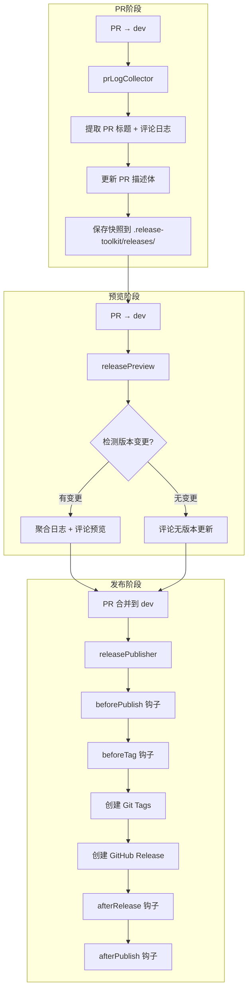
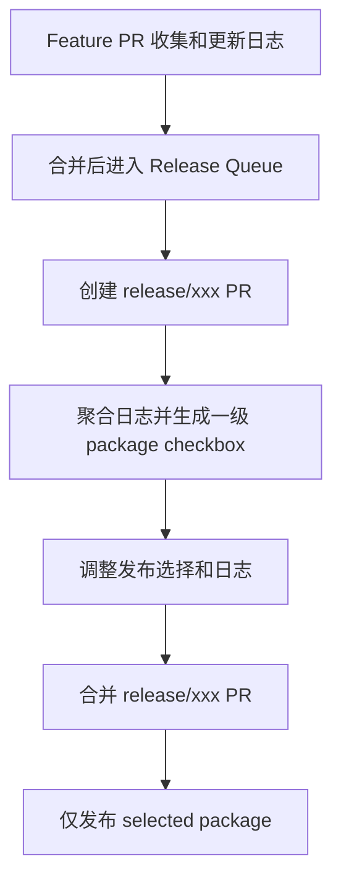
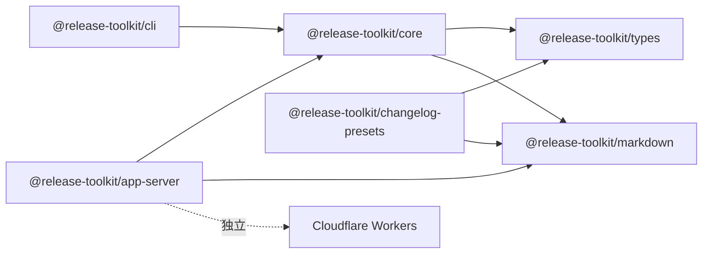

# Release Toolkit

CI 驱动的 **Monorepo 发布工具链** —— 自动收集 PR 变更日志、聚合版本发布、创建 GitHub Release。

文档统一入口：[docs/README.md](./docs/README.md)。需要交给 AI 实施目标架构时，从 [Release Plan v1 可执行实施规格](./docs/implementation/README.md) 开始。

## 整体流程

> 当前实现以 `collect`、`preview`、`publish` 三个命令为主。后续架构将增加贯穿全周期的 Release Plan：先生成并确认发布计划，再由 publisher 严格执行。完整设计见 [发布计划中心架构](./docs/architecture/09-release-plan-architecture.md)。



## 三大核心命令

| 命令              | 功能                                     | 触发时机  |
| ----------------- | ---------------------------------------- | --------- |
| `release collect` | 收集 PR 日志，写入 PR 描述体             | PR 提交时 |
| `release preview` | 版本发布预览，检测版本变更并评论         | PR 预览时 |
| `release publish` | 创建 Git Tag + GitHub Release + 执行钩子 | PR 合并时 |

### 目标发布模型



`collect` 负责收集，格式化插件负责输出，Release Plan 负责发布决策，`publish` 负责执行。当前实现与目标架构的差异请见 [架构文档](./docs/architecture/README.md)。

## CLI 使用

### collect —— PR 日志收集

```bash
$ release collect --pr-number 123 --owner my-org --repo my-repo
$ release collect --pr-number 123 --owner my-org --repo my-repo --no-save
$ release collect --pr-number 123 --owner my-org --repo my-repo --config-path ./config.release.json
```

| 选项            | 说明                                    | 默认值                         |
| --------------- | --------------------------------------- | ------------------------------ |
| `--pr-number`   | PR 编号                                 | 必填                           |
| `--owner`       | 仓库所有者                              | 必填                           |
| `--repo`        | 仓库名称                                | 必填                           |
| `--token`       | GitHub Token                            | `GITHUB_TOKEN` 环境变量        |
| `--save`        | 保存快照到 `.release-toolkit/releases/` | `true`                         |
| `--no-save`     | 不保存快照                              | -                              |
| `--cwd`         | 工作目录                                | `process.cwd()`                |
| `--config-path` | 配置文件路径                            | `.release-toolkit/config.json` |

### preview —— 版本发布预览

```bash
$ release preview --pr-number 123 --owner my-org --repo my-repo
```

| 选项            | 说明         | 默认值                         |
| --------------- | ------------ | ------------------------------ |
| `--pr-number`   | PR 编号      | 必填                           |
| `--owner`       | 仓库所有者   | 必填                           |
| `--repo`        | 仓库名称     | 必填                           |
| `--token`       | GitHub Token | `GITHUB_TOKEN` 环境变量        |
| `--cwd`         | 工作目录     | `process.cwd()`                |
| `--config-path` | 配置文件路径 | `.release-toolkit/config.json` |

### publish —— 版本发布

```bash
$ release publish                              # 由 CI 自动触发（推荐）
$ release publish --dry-run                    # 本地预演（不创建任何资源）
$ release publish --owner my-org --repo my-repo # 显式指定仓库
```

| 选项            | 说明         | 默认值                         |
| --------------- | ------------ | ------------------------------ |
| `--owner`       | 仓库所有者   | 从 `GITHUB_REPOSITORY` 读取    |
| `--repo`        | 仓库名称     | 从 `GITHUB_REPOSITORY` 读取    |
| `--token`       | GitHub Token | `GITHUB_TOKEN` 环境变量        |
| `--dry-run`     | 空跑模式     | `false`                        |
| `--cwd`         | 工作目录     | `process.cwd()`                |
| `--config-path` | 配置文件路径 | `.release-toolkit/config.json` |

## 生命周期钩子

### releasePublisher 钩子

| 钩子            | 触发时机              | 用途                      |
| --------------- | --------------------- | ------------------------- |
| `beforePublish` | 发布流程开始前        | 预检查、构建验证          |
| `beforeTag`     | 创建 Git Tag 前       | 自定义 tag 格式、额外校验 |
| `afterRelease`  | GitHub Release 创建后 | 部署到 CDN、发送通知      |
| `afterPublish`  | 全部发布完成后        | 清理、统计、总结          |

### prLogCollector 钩子（插件）

| 钩子            | 触发时机        |
| --------------- | --------------- |
| `beforeCollect` | 收集 PR 日志前  |
| `afterCollect`  | 收集完成/失败后 |

### releasePreview 钩子（插件）

| 钩子            | 触发时机   |
| --------------- | ---------- |
| `beforePreview` | 预览生成前 |
| `afterPreview`  | 预览生成后 |

## 钩子执行方式

支持三种执行方式：

| 类型      | 说明         | 示例                                                            |
| --------- | ------------ | --------------------------------------------------------------- |
| `command` | Shell 命令   | `{ "type": "command", "command": "pnpm -r publish" }`           |
| `script`  | 项目脚本文件 | `{ "type": "script", "script": "./scripts/release.js" }`        |
| `package` | npm 包       | `{ "type": "package", "name": "semantic-release", "args": [] }` |

```json
{
  "releasePublisher": {
    "beforeTag": [{ "type": "command", "command": "pnpm build" }],
    "afterRelease": [
      { "type": "command", "command": "pnpm -r publish --access public" },
      { "type": "script", "script": "./scripts/notify.js" },
      { "type": "package", "name": "@myorg/release-notify", "args": ["--channel", "#releases"] }
    ],
    "afterPublish": [{ "type": "command", "command": "pnpm -r deploy" }]
  }
}
```

## 包结构

```
packages/
├── types/             # 共享类型定义（打破 core ↔ presets 循环依赖）
├── markdown/          # 共享 Markdown 工具（列表、RELEASE-LOG 解析、emoji）
├── core/              # 核心引擎（版本检测、PR 日志收集、发布预览、发布器）
├── cli/               # CLI 入口（release collect/preview/publish 命令）
├── changelog-presets/ # Changelog 格式化预设（emoji-prefix, category-group, markdown-bold）
└── app-server/        # GitHub App Webhook 服务（Cloudflare Worker）
```

## 依赖关系



## 配置

在项目根目录创建 `.release-toolkit/config.json`：

```json
{
  "branches": {
    "base": "dev"
  },
  "prLogCollector": {
    "releaseLogMarker": {
      "start": "<!-- RELEASE-LOG-START -->",
      "end": "<!-- RELEASE-LOG-END -->"
    },
    "outputSections": {
      "notification": true,
      "preview": true,
      "editGuide": true
    },
    "logExtraction": {
      "source": "comment",
      "commentPosition": "first"
    }
  },
  "releasePreview": {
    "workspaceFile": "pnpm-workspace.yaml",
    "noChangeMessage": "⚠️ 本次 PR 未检测到任何包的版本变更",
    "previewOutput": {
      "showVersionDiff": true,
      "showPackageList": true,
      "showChangelog": true
    }
  },
  "releasePublisher": {
    "createGithubRelease": true,
    "gitTags": {
      "format": "{packageName}@{version}",
      "message": "Release {packageName}@{version}"
    },
    "beforeTag": [],
    "afterRelease": [{ "type": "command", "command": "pnpm -r publish" }],
    "afterPublish": []
  },
  "plugins": ["emoji-prefix", "category-group", "markdown-bold"]
}
```

### 配置字段说明

#### 分支配置

| 字段            | 说明                                        | 默认值 |
| --------------- | ------------------------------------------- | ------ |
| `branches.base` | 目标分支（PR 日志收集、版本预览与发布共用） | `dev`  |

#### PR 日志收集器配置

| 字段                                           | 说明                                  | 默认值                       |
| ---------------------------------------------- | ------------------------------------- | ---------------------------- |
| `prLogCollector.releaseLogMarker.start`        | 日志标记开始                          | `<!-- RELEASE-LOG-START -->` |
| `prLogCollector.releaseLogMarker.end`          | 日志标记结束                          | `<!-- RELEASE-LOG-END -->`   |
| `prLogCollector.outputSections.notification`   | 是否显示通知区块                      | `true`                       |
| `prLogCollector.outputSections.preview`        | 是否显示预览区块                      | `true`                       |
| `prLogCollector.outputSections.editGuide`      | 是否显示编辑指南                      | `true`                       |
| `prLogCollector.logExtraction.source`          | 日志提取来源（`comment` / `pr-body`） | `comment`                    |
| `prLogCollector.logExtraction.commentPosition` | 评论位置（`first` / `latest`）        | `first`                      |

#### 发布预览配置

| 字段                             | 说明               | 默认值                                   |
| -------------------------------- | ------------------ | ---------------------------------------- |
| `releasePreview.workspaceFile`   | Monorepo 配置文件  | `pnpm-workspace.yaml`                    |
| `releasePreview.noChangeMessage` | 无版本变更时的提示 | `⚠️ 本次 PR 未检测到任何包的版本变更...` |

#### 发布器配置

| 字段                                   | 说明                                                   | 默认值                            |
| -------------------------------------- | ------------------------------------------------------ | --------------------------------- |
| `releasePublisher.createGithubRelease` | 是否创建 GitHub Release                                | `true`                            |
| `releasePublisher.gitTags.format`      | Tag 格式（支持 `{packageName}` 和 `{version}` 占位符） | `{packageName}@{version}`         |
| `releasePublisher.gitTags.message`     | Release message 格式                                   | `Release {packageName}@{version}` |

#### 插件

| 插件名           | 功能                            |
| ---------------- | ------------------------------- |
| `emoji-prefix`   | 根据 commit 类型添加 emoji 前缀 |
| `category-group` | 按 commit 类型分组              |
| `markdown-bold`  | 将 scope 加粗显示               |

## App Server（GitHub App）

`@release-toolkit/app-server` 是一个 Cloudflare Worker，用于接收 GitHub Webhook 事件并触发 CI 流程。

### 支持的事件

| 事件                                                                 | 行为                            |
| -------------------------------------------------------------------- | ------------------------------- |
| `pull_request` (opened/reopened/synchronize/edited/ready_for_review) | 收集 PR 日志并评论              |
| `pull_request` (closed + merged)                                     | 触发 `release-publish` workflow |
| `pull_request_review` (submitted + approved)                         | 将确认后的日志写入 PR 描述体    |
| `repository_dispatch`                                                | 手动重试入口                    |

### 环境变量

| 变量                       | 说明                 | 默认值                |
| -------------------------- | -------------------- | --------------------- |
| `GITHUB_APP_ID`            | GitHub App ID        | -                     |
| `GITHUB_APP_PRIVATE_KEY`   | GitHub App 私钥      | -                     |
| `GITHUB_TOKEN`             | GitHub Token         | -                     |
| `GITHUB_WEBHOOK_SECRET`    | Webhook 签名密钥     | -                     |
| `RELEASE_BASE_BRANCH`      | 目标分支             | `dev`                 |
| `RELEASE_PUBLISH_WORKFLOW` | 发布 workflow 文件名 | `release-publish.yml` |
| `OUTPUT_SECTIONS`          | 输出区块配置（JSON） | -                     |

## License

MIT
