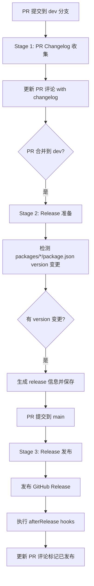

# Release Toolkit 架构文档

## 概述

Release Toolkit 是一个 CI 驱动的三阶段发布工具，支持 monorepo 项目的版本检测、changelog 生成和 GitHub Release 发布。

## 三阶段架构



## Stage 详解

### Stage 1: PR Changelog 收集

**触发条件**: PR 提交到 `dev` 分支

**执行逻辑**:
1. 从 GitHub API 获取 PR 数据
2. 渲染 changelog markdown
3. 保存快照到 `.releasetoolkit/changelog/prs/`
4. 发布/更新 PR 评论

**核心类**: `Stage1PRCollector`

**CLI 命令**: `release pr-changelog fetch --pr-number <N> --save --skip-if-exists --post-comment`

**工作流文件**: `.github/workflows/stage1-pr-changelog.yml`

---

### Stage 2: Release 准备

**触发条件**: PR 合并到 `dev` 分支

**执行逻辑**:
1. 检测 `packages/*/package.json` 的 version 变更
2. 收集所有保存的 PR changelog 快照
3. 构建统一的 release changelog
4. 保存 release 信息到 `.releasetoolkit/release/info.json`

**核心类**: `Stage2ReleasePreparer`

**CLI 命令**: `release prepare --base main --dev dev`

**工作流文件**: `.github/workflows/stage2-release-prepare.yml`

---

### Stage 3: Release 发布

**触发条件**: PR 合并到 `main` 分支

**执行逻辑**:
1. 读取 Stage 2 保存的 release 信息（或重新检测）
2. 消费所有保存的 PR changelog 快照
3. 构建统一的 Release Changelog
4. 写入 per-package CHANGELOG.md
5. 创建 git tags
6. 创建 GitHub Releases
7. 执行 `afterRelease` hooks
8. 更新 PR 评论标记为已发布

**核心类**: `Stage3ReleasePublisher`

**CLI 命令**: `release ci`

**工作流文件**: `.github/workflows/stage3-release-publish.yml`

---

## 核心设计原则

### 1. 逻辑与 CLI 剥离

所有核心逻辑都在 `packages/core/src/stages/` 中的独立类中实现：
- `Stage1PRCollector`
- `Stage2ReleasePreparer`
- `Stage3ReleasePublisher`

CLI 命令只负责参数解析和调用核心类，不包含业务逻辑。

### 2. 可配置执行顺序

每个 Stage 类的方法都是独立的私有方法，未来可以轻松：
- 调整步骤顺序
- 添加/删除步骤
- 替换某个步骤的实现

示例（Stage 3 的步骤）：
```typescript
// 当前顺序
Step 0: detectGitHubContext()
Step 1: loadReleaseInfo()
Step 2: consumeSnapshots()
Step 3: buildChangelog()
Step 4: writePackageChangelogs()
Step 5: createTags()
Step 6: createReleases()
Step 7: updatePRComment()
Step 8: saveSummary()
```

### 3. 配置系统

配置加载采用 3 级合并策略：
1. **默认值** - 硬编码的默认配置
2. **配置文件** - `.releasetoolkit/config.json`
3. **显式选项** - CLI 参数或环境变量（最高优先级）

配置文件示例：
```json
{
  "devBranch": "dev",
  "baseRef": "main",
  "createTags": true,
  "createRelease": true,
  "afterRelease": ["./scripts/post-release.sh"],
  "prChangelog": {
    "packagesDir": "packages",
    "rootTag": "root"
  }
}
```

---

## 目录结构

```
release-toolkit/
├── packages/
│   ├── core/
│   │   └── src/
│   │       ├── stages/              # 三阶段核心逻辑
│   │       │   ├── stage1-pr-collector.ts
│   │       │   ├── stage2-release-preparer.ts
│   │       │   └── stage3-release-publisher.ts
│   │       ├── changelog/          # Changelog 生成逻辑
│   │       ├── plugin/             # 插件系统
│   │       ├── tag/                # Git tag 管理
│   │       ├── publish/            # GitHub Release 发布
│   │       └── config/            # 配置加载
│   └── cli/
│       └── src/
│           └── commands/           # CLI 命令
│               ├── pr-changelog.command.ts
│               ├── prepare.command.ts
│               └── ci.command.ts
├── .github/
│   └── workflows/                 # GitHub Actions 工作流
│       ├── stage1-pr-changelog.yml
│       ├── stage2-release-prepare.yml
│       └── stage3-release-publish.yml
└── .releasetoolkit/              # 运行时数据
    ├── config.json                # 配置文件
    ├── changelog/
    │   └── prs/                 # PR changelog 快照
    └── release/
        └── info.json             # Stage 2 输出的 release 信息
```

---

## 扩展指南

### 添加新的步骤

以在 Stage 3 中添加 "发送 Slack 通知" 步骤为例：

1. 在 `Stage3ReleasePublisher` 中添加新方法：
```typescript
private async sendSlackNotification(markdown: string, errors: string[]): Promise<void> {
  // 实现发送逻辑
}
```

2. 在 `run()` 方法的适当位置调用：
```typescript
// Step 8: Send Slack notification
console.log('\n[Stage3] Step 8: Sending Slack notification...');
await this.sendSlackNotification(markdown, errors);
```

### 添加新的 Stage

1. 创建新的 Stage 类（参考现有 Stage 类）
2. 创建对应的 CLI 命令
3. 创建 GitHub Actions 工作流
4. 在 `packages/core/src/index.ts` 中导出

### 自定义插件

插件系统支持两种类型：
- **ILineFormatter**: 逐条处理 changelog 条目
- **ILogFormatter**: 处理整个 changelog 文档

示例：
```typescript
export class MyPlugin implements ILineFormatter {
  name = 'my-plugin';
  priority = 10;

  format(entry: ChangeLogEntry): ChangeLogEntry | null {
    // 自定义处理逻辑
    return entry;
  }
}
```

---

## 故障排查

### Stage 1 失败

**症状**: PR 评论未更新

**检查**:
1. `GITHUB_TOKEN` 权限是否足够（需要 `pull-requests: write`）
2. `--post-comment` 选项是否添加
3. 查看 Actions 日志

### Stage 2 未触发

**症状**: 合并到 `dev` 后没有生成 release 信息

**检查**:
1. `packages/*/package.json` 的 version 是否变更
2. 工作流触发条件是否正确
3. 查看 Actions 日志

### Stage 3 失败

**症状**: Tags 或 Releases 未创建

**检查**:
1. `GITHUB_TOKEN` 权限是否足够（需要 `contents: write`)
2. `.releasetoolkit/release/info.json` 是否存在
3. `afterRelease` hooks 是否可执行
4. 查看 Actions 日志

---

## 最佳实践

1. **提交前测试**: 使用 `--dry-run` 选项预览效果
2. **版本号规范**: 遵循语义化版本 (semver)
3. **PR 模板**: 在 PR 描述中使用 `<!-- RELEASE-LOG-START -->` 和 `<!-- RELEASE-LOG-END -->` 标记
4. **Hook 脚本**: 确保脚本有执行权限 (`chmod +x`)

---

## 更新日志

- **2026-05-02**: 重构三阶段架构，剥离 CLI 和核心逻辑
- **2026-03-18**: 初始版本
