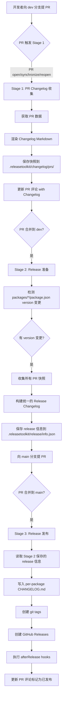

# Release Toolkit 工作流程图

## 完整流程



---

## 触发条件详解

### Stage 1: PR Changelog 收集

**文件**: `.github/workflows/stage1-pr-changelog.yml`

**触发条件**:
```yaml
on:
  pull_request:
    branches: [dev]
    types: [opened, synchronize, reopened]
```

**执行内容**:
1. Checkout 代码
2. 安装依赖并构建
3. 运行 `release pr-changelog fetch --pr-number ${{ github.event.number }} --save --skip-if-exists --post-comment`
4. 提交并推送快照文件

**效果**:
- PR 评论区会显示 Changelog 预览
- `.releasetoolkit/changelog/prs/` 目录保存 PR 快照

---

### Stage 2: Release 准备

**文件**: `.github/workflows/stage2-release-prepare.yml`

**触发条件**:
```yaml
on:
  pull_request:
    branches: [dev]
    types: [closed]

jobs:
  prepare:
    if: github.event.pull_request.merged == true
```

**执行内容**:
1. Checkout 代码
2. 安装依赖并构建
3. 运行 `release prepare --base main --dev dev`
4. 检测 `packages/*/package.json` 的 version 变更
5. 收集所有 PR 快照并构建 Changelog
6. 保存 release 信息到 `.releasetoolkit/release/info.json`

**效果**:
- 只有 PR 合并到 `dev` 后才触发
- 只有 version 变更时才生成 release 信息
- 生成的 release 信息供 Stage 3 使用

---

### Stage 3: Release 发布

**文件**: `.github/workflows/release.yml`

**触发条件**:
```yaml
on:
  pull_request:
    branches: [main]
    types: [closed]

jobs:
  publish:
    if: github.event.pull_request.merged == true
```

**执行内容**:
1. Checkout 代码（fetch-depth: 0）
2. 安装依赖并构建
3. 运行 `release ci`
4. 读取 `.releasetoolkit/release/info.json`
5. 写入 per-package CHANGELOG.md
6. 创建 git tags
7. 创建 GitHub Releases
8. 执行 `afterRelease` hooks
9. 更新 PR 评论标记为已发布

**效果**:
- 只有向 `main` 分支提 PR 并合并后才触发
- 完整的 CI/CD 发布流程
- 自动创建 tags 和 GitHub Releases

---

## 分支策略

```
dev分支: 开发分支
  ↓ PR 提交
Stage 1: 收集 PR Changelog
  ↓ PR 合并
dev分支: 合并后触发
Stage 2: 准备 Release 信息
  ↓ PR 提交（把 dev 合并到 main）
main分支: PR 提交
Stage 3: 发布 Release（PR 合并后触发）
```

---

## 使用示例

### 场景 1: 开发者提交 PR 到 dev

1. 开发者创建 PR: `feature-branch` → `dev`
2. **自动触发 Stage 1**:
   - 收集 PR 信息
   - 更新 PR 评论显示 Changelog 预览
3. PR 评论区显示:
   ```markdown
   ## 📝 PR Changelog Preview
   
   ### Features
   - Add new feature X
   
   ### Bug Fixes
   - Fix issue Y
   ```

### 场景 2: PR 合并到 dev

1. Maintainer 合并 PR 到 `dev`
2. **自动触发 Stage 2**:
   - 检测 `packages/*/package.json` 的 version 变更
   - 如果有变更，生成 release 信息
   - 保存到 `.releasetoolkit/release/info.json`

### 场景 3: 提交 PR 从 dev 到 main

1. Maintainer 创建 PR: `dev` → `main`
2. PR 审查通过后合并
3. **自动触发 Stage 3**:
   - 读取 Stage 2 生成的 release 信息
   - 创建 git tags
   - 创建 GitHub Releases
   - 执行 hooks
   - 更新 PR 评论标记为已发布
4. PR 评论区更新为:
   ```markdown
   ## ✅ Release Published
   
   **Date:** `2026-05-02`
   
   **Tags created:**
     - `@release-toolkit/core@1.0.0`
   
   ### 📦 Released Versions:
   | Package | Old | New | Type |
   |---------|-----|-----|------|
   | `@release-toolkit/core` | `0.0.0` | `1.0.0` | 🟢 MINOR |
   
   ### 📝 Changelog:
   ### Features
   - Add new feature X
   ```

---

## 配置示例

### `.releasetoolkit/config.json`

```json
{
  "devBranch": "dev",
  "baseRef": "main",
  "createTags": true,
  "createRelease": true,
  "afterRelease": [
    "./scripts/notify-slack.sh",
    "./scripts/update-docs.sh"
  ],
  "prChangelog": {
    "packagesDir": "packages",
    "rootTag": "root"
  }
}
```

---

## 关键设计点

### 1. PR 触发条件精确控制

- **Stage 1**: 只在向 `dev` 提 PR 时触发（`branches: [dev]`）
- **Stage 2**: 只在 PR 合并到 `dev` 后触发（`types: [closed]` + `merged == true`）
- **Stage 3**: 只在向 `main` 提 PR 并合并后触发（`branches: [main]` + `merged == true`）

### 2. 三阶段完全解耦

- **Stage 1**: 只负责收集 PR 信息
- **Stage 2**: 只负责准备 release 信息
- **Stage 3**: 只负责发布 release

每个阶段都是独立的，可以单独测试、调试或禁用。

### 3. 通过 PR 合并触发（而非 push）

**原因**:
- PR 合并后可以访问 `github.event.pull_request.merged` 状态
- 可以获取 PR 编号、作者、reviewer 等信息
- 更符合 GitFlow 工作流

---

## 故障排查

### Stage 1 未触发

**检查**:
1. PR 是否向 `dev` 分支提交？
2. `.github/workflows/stage1-pr-changelog.yml` 是否存在？
3. `GITHUB_TOKEN` 权限是否足够？

### Stage 2 未触发

**检查**:
1. PR 是否合并到 `dev` 分支？
2. `packages/*/package.json` 的 version 是否变更？
3. `.releasetoolkit/release/info.json` 是否生成？

### Stage 3 未触发

**检查**:
1. PR 是否向 `main` 分支提交并合并？
2. `.github/workflows/release.yml` 中的条件是否正确？
3. `.releasetoolkit/release/info.json` 是否存在？

---

## 总结

✅ **精确控制**: 每个 Stage 只在特定分支的 PR 操作时触发
✅ **三阶段解耦**: 每个 Stage 独立，易于维护和扩展
✅ **自动化**: 从 PR 提交到 Release 发布，全流程自动化
✅ **灵活性**: 通过配置文件轻松调整行为

🎉 **现在你的 Release Toolkit 拥有了完整、精确的三阶段 CI/CD 流程！**
