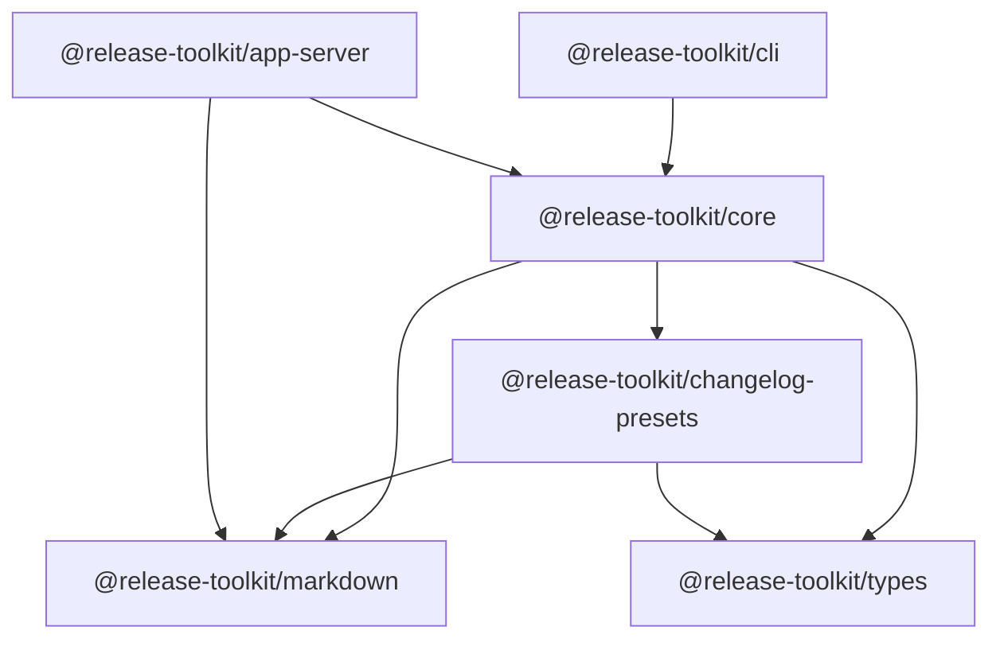

# 项目概览与目录结构

## Monorepo 结构

```
release-toolkit/
├── packages/
│   ├── types/             # 共享类型（打破 core ↔ presets 循环依赖）
│   ├── markdown/          # 共享 Markdown 纯函数（列表、RELEASE-LOG、OUTPUT 区）
│   ├── core/              # 核心库：版本检测、changelog 引擎、插件系统、CI 层
│   ├── cli/               # CLI 入口：commander 命令行工具
│   ├── changelog-presets/ # 预设格式化器：emoji、分类分组等
│   └── app-server/        # GitHub App 服务端（Cloudflare Worker）
├── tsdown.config.ts       # 共享构建配置
├── pnpm-workspace.yaml    # 工作区配置
├── eslint.config.js       # ESLint 配置
└── package.json           # 根配置
```

## 包依赖关系图



```
                    ┌─────────────────────────┐
                    │  @release-toolkit/cli   │
                    └───────────┬─────────────┘
                                │
                    ┌───────────▼─────────────┐
                    │  @release-toolkit/core  │
                    └───┬─────────┬─────┬───┘
                        │         │     │
         ┌──────────────┘         │     └──────────────┐
         │                        │                    │
┌────────▼────────┐    ┌─────────▼─────────┐   ┌──────▼──────┐
│ changelog-presets│    │ @release-toolkit/  │   │  app-server │
│                  │    │     markdown       │   │  (Worker)   │
└────────┬─────────┘    └────────────────────┘   └──────┬──────┘
         │                                                │
         └────────────────────┬───────────────────────────┘
                                │
                    ┌───────────▼─────────────┐
                    │  @release-toolkit/types │
                    └─────────────────────────┘
```

## 各包职责速览

| 包名 | 职责 | 入口文件 |
|------|------|----------|
| `@release-toolkit/types` | 共享 TypeScript 类型定义 | `src/index.ts` |
| `@release-toolkit/markdown` | 列表 / RELEASE-LOG / OUTPUT 区纯函数 | `src/index.ts` |
| `@release-toolkit/core` | 版本检测、changelog、插件、发布执行 | `src/index.ts` |
| `@release-toolkit/cli` | 命令行界面 | `src/index.ts` |
| `@release-toolkit/changelog-presets` | 预设格式化器 | `src/index.ts` |
| `@release-toolkit/app-server` | GitHub App Webhook（Worker） | `src/index.ts` |

## 核心功能

| 功能 | 触发时机 | 说明 |
|------|----------|------|
| `prLogCollector` | PR → `branches.base`（默认 dev） | 收集 PR 变更日志 |
| `releasePreview` | PR → `branches.base` | 版本发布预览 |
| `releasePublisher` | PR 合并到 `branches.base` | 执行版本发布 |

## 技术栈

| 技术 | 用途 |
|------|------|
| TypeScript | 类型安全 |
| tsdown | 快速构建 ESM 库 |
| commander | CLI 参数解析 |
| octokit | GitHub API 客户端 |
| simple-git | Git 操作（CI runner） |
| semver | 语义化版本处理 |
| Cloudflare Workers | GitHub App 部署目标 |

## 构建配置

```typescript
// tsdown.config.ts
export default defineConfig({
  format: ['esm'],      // 仅输出 ESM 格式
  dts: true,            // 生成 .d.ts 类型声明
  sourcemap: false,     // 不生成 sourcemap
  clean: true,          // 每次构建前清理
});
```

## 架构特点

1. **关注点分离**：core（功能）、cli（界面）、presets（格式化）、markdown（纯文本）职责清晰
2. **插件化设计**：支持自定义 changelog 格式化器；Worker 侧用 markdown 内置 emoji 保底
3. **零配置可用**：提供合理默认值，开箱即用
4. **幂等更新**：PR 描述体 / 评论更新支持幂等（`upsertOutputInBody`）
5. **CI 友好**：设计为 GitHub Actions 工作流集成
6. **Monorepo 支持**：workspace 配置 + API 双模式版本检测
