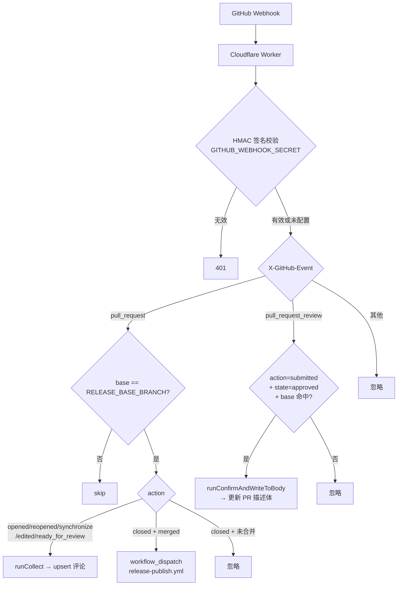

# GitHub App 服务端详解 (@release-toolkit/app-server)

## 职责定位

App Server 是一个 **轻量的事件分发层**，运行在 Cloudflare Workers 上：

- 接收 GitHub Webhook，按 `branches.base` 过滤无关 PR
- 通过 GitHub API（无本地 git）生成与 CLI 一致格式的「待审批」评论
- 监听 `pull_request_review.submitted` (`state=approved`) 自动写入 PR 描述体
- PR 合并到目标分支后，通过 `workflow_dispatch` 触发 CI 中的 `release-publish.yml`，
  由 Actions runner 执行 `@release-toolkit/core` 的 `publishRelease`（依赖 Node + git）

> 完整的 tag/Release 创建仍在 CI runner 中执行，Worker 仅负责事件分发和评论。

---

## 实现状态总览

| 功能 | 状态 | 说明 |
|------|------|------|
| Webhook 签名验证 | ✅ 已实现 | Web Crypto HMAC-SHA256 |
| `pull_request` 事件处理 | ✅ 已实现 | `opened`/`reopened`/`synchronize`/`edited`/`ready_for_review` |
| `pull_request_review.submitted` (approved) | ✅ 已实现 | 写入 PR 描述体 `RELEASE-TOOLKIT-OUTPUT` 标记区 |
| `pull_request.closed (merged)` | ✅ 已实现 | 触发 `release-publish.yml` workflow |
| base 分支过滤 | ✅ 已实现 | 通过 `RELEASE_BASE_BRANCH` env |
| 输出区块开关 | ✅ 已实现 | 通过 `OUTPUT_SECTIONS` env |
| 通过 `installation.id` 获取 octokit | ✅ 已实现 | `App.getInstallationOctokit` |
| 版本 diff 表 | ✅ 已实现 | `pulls.listFiles` + `repos.getContent` |
| Web UI 管理 | 🔲 规划中 | 提供可视化管理界面 |

---

## 模块结构

```
packages/app-server/
├── src/
│   └── index.ts              # 单文件实现（Worker 入口）
├── tsdown.config.ts
├── wrangler.toml             # Cloudflare Workers 配置
└── package.json
```

> 单文件实现以减小 bundle 体积、避免 Worker 启动开销。

---

## 事件分发逻辑



---

## 输出区块开关 (`OUTPUT_SECTIONS`)

通过环境变量 `OUTPUT_SECTIONS` 控制评论组成（JSON 字符串）：

```jsonc
{
  "notification": true, // 顶部「待审批」状态 + 版本 diff 表
  "preview": true,      // 中部：按变更包列出 - title + bullets
  "editGuide": true     // 底部：折叠的「如何修改变更日志」
}
```

不设置时全部默认为 `true`。

---

## 内部函数概览

| 函数 | 说明 |
|------|------|
| `verifySignature` | Web Crypto HMAC-SHA256，比较 `sha256=` 前缀 |
| `parseReleaseLog` | 解析 `## pkg` + 列表，跳过 `### *` 子标题 |
| `extractReleaseLog` | 从 PR body 中截取 `<!-- RELEASE-LOG-START/END -->` 区域 |
| `formatTitleBullet` / `formatChangeLogBullets` | 与 core 输出一致的列表渲染（含 emoji 前缀） |
| `listChangedPackages` | `octokit.paginate(pulls.listFiles)` 找出 `packages/*/package.json` |
| `collectVersionDiffs` | 对每个变更包读取 base/head 的 `package.json` → 版本 diff |
| `findToolComment` / `upsertPRComment` | 通过 `release-toolkit-comment-start` 锚点上 upsert 评论 |
| `upsertOutputInBody` | 幂等替换 PR 描述体中的 `RELEASE-TOOLKIT-OUTPUT` 标记区 |
| `dispatchWorkflow` | `actions.createWorkflowDispatch` 触发 CI |
| `acquireOctokit` | 优先用 `App.getInstallationOctokit`，回落到匿名 |

---

## 环境变量

| 变量 | 必填 | 默认 | 说明 |
|------|------|------|------|
| `GITHUB_APP_ID` | ⚠️ App 模式 | - | GitHub App ID |
| `GITHUB_APP_PRIVATE_KEY` | ⚠️ App 模式 | - | PEM 私钥（PKCS#8） |
| `GITHUB_WEBHOOK_SECRET` | 推荐 | - | Webhook 签名密钥（缺失时跳过验证，仅供 dev） |
| `RELEASE_BASE_BRANCH` | ❌ | `dev` | 触发收集/发布的目标分支 |
| `RELEASE_PUBLISH_WORKFLOW` | ❌ | `release-publish.yml` | 合并后触发的 workflow 文件名 |
| `OUTPUT_SECTIONS` | ❌ | 全部 `true` | 评论输出区块开关 JSON |

---

## release-publish.yml 模板（CI 侧）

> 仓库已提供可直接使用的模板：[.github/workflows/release-publish.yml](../../.github/workflows/release-publish.yml)
> 以及不依赖 Worker 的兜底版本 [.github/workflows/release-collect.yml](../../.github/workflows/release-collect.yml)。

```yaml
name: release-publish
on:
  workflow_dispatch:
    inputs:
      pr_number:
        required: true
      pr_title:
        required: true

jobs:
  publish:
    runs-on: ubuntu-latest
    steps:
      - uses: actions/checkout@v4
        with: { fetch-depth: 0 }
      - uses: pnpm/action-setup@v4
      - uses: actions/setup-node@v4
        with: { node-version: 24 }
      - run: pnpm install
      - run: pnpm release publish
        env:
          GITHUB_TOKEN: ${{ secrets.GITHUB_TOKEN }}
```

App Server 仅触发该 workflow，发布逻辑由 `@release-toolkit/core` 在 CI 中执行。

---

## 部署

```bash
pnpm --filter @release-toolkit/app-server build
pnpm --filter @release-toolkit/app-server deploy
```

---

## 依赖

- `octokit`（运行时）—— GitHub API 客户端
- `@cloudflare/workers-types` / `wrangler`（开发时）
- 不直接 `import` `@release-toolkit/core` 的 Node-only 模块（`fs`/`simple-git` 等），
  确保 bundle 后能在 Workers 运行
