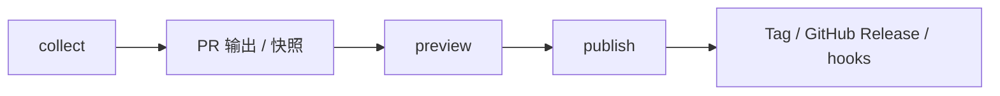
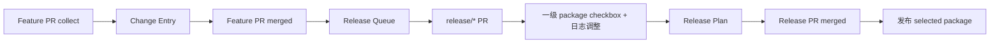
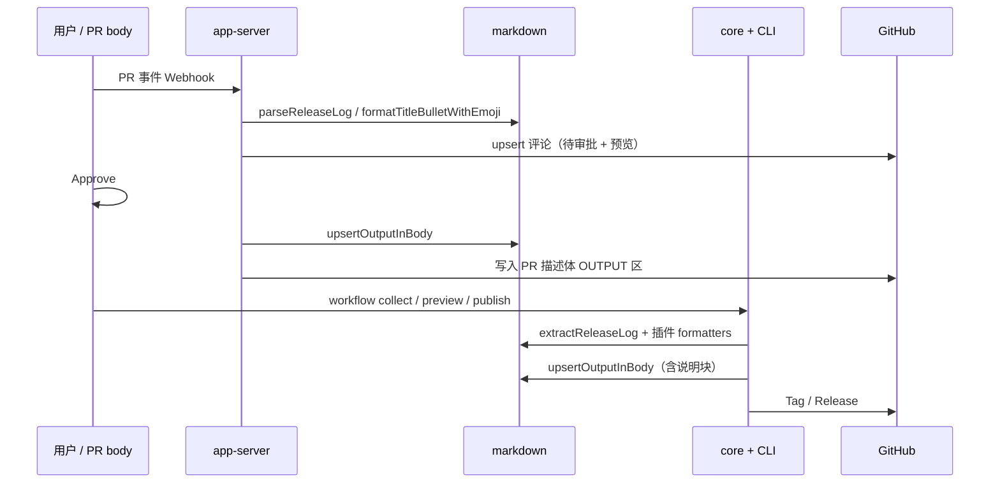

# 工作流程详解

> 本文记录当前仓库已经存在的 PR 日志收集、预览和发布流程。它描述的是现状；关于目标流程先阅读 [09-release-plan-architecture.md](./09-release-plan-architecture.md)，实际实施按 [实施规格](../implementation/README.md) 执行。

## 当前流程与目标流程的关系

当前流程是：



目标流程先完成 Feature PR 日志收集，再通过 `release/*` PR 聚合、选择并确认发布计划：



因此，本文中“扫描变更包并发布”的描述属于当前行为；未来应改为“生成候选发布计划并执行已确认计划”。

## 整体流程概览

```
┌─────────────────────────────────────────────────────────────────────────────┐
│                           PR 生命周期                                        │
├─────────────────────────────────────────────────────────────────────────────┤
│                                                                             │
│   提交 PR (首次)                    PR 被 Approve                           │
│        ↓                                      ↓                            │
│   ┌─────────────┐                  ┌─────────────┐                         │
│   │ prLogCollector │                │ 日志写入触发  │                         │
│   │ 输出: 待审批通知 │                │ 自动推送日志 │                         │
│   │       + 预览日志 │                │ 到 PR 描述体 │                         │
│   │       + 修改指南 │                └──────┬──────┘                         │
│   └─────────────┘                          ↓                                │
│        ↓                           ┌─────────────┐                         │
│   保存快照到                        │  合并到 dev   │                         │
│   .release-toolkit/                 └──────┬──────┘                         │
│   releases/                                ↓                                │
└─────────────────────────────────────────────────────────────────────────────┘
                                          ↓
┌─────────────────────────────────────────────────────────────────────────────┐
│                           发布流程                                           │
├─────────────────────────────────────────────────────────────────────────────┤
│                                                                             │
│   PR 合并到 dev                                                              │
│        ↓                                                                    │
│   ┌─────────────────────────────────────────────────────────────────────┐   │
│   │                    releasePublisher                                  │   │
│   │  1. 扫描 packages/ 检测 version 变更                                  │   │
│   │  2. 按变更的 version 创建 Git Tags                                    │   │
│   │  3. 创建 GitHub Release + Changelog                                  │   │
│   │  4. 执行 afterRelease 钩子                                           │   │
│   │     - npm publish                                                    │   │
│   │     - 自定义通知                                                      │   │
│   │     - 其他脚本                                                        │   │
│   └─────────────────────────────────────────────────────────────────────┘   │
│                                                                             │
└─────────────────────────────────────────────────────────────────────────────┘
```

---

## 共享层：谁负责哪段 Markdown

端到端流程中，**同一份视觉规范**由 `@release-toolkit/markdown` 保证，不同运行时再叠加各自能力：



| 阶段         | 运行时     | markdown 入口                                   | 额外能力                                 |
| ------------ | ---------- | ----------------------------------------------- | ---------------------------------------- |
| 待审批评论   | App Server | `buildPRComment` → `formatTitleBulletWithEmoji` | 读仓库 `config.json` 的 `outputSections` |
| 用户编辑区   | 用户       | `RELEASE_LOG_*` 标记                            | —                                        |
| Approve 写入 | App Server | `upsertOutputInBody`                            | 从评论生成确认日志                       |
| CI collect   | core       | `formatTitleBulletLine` + 插件                  | `git diff` 变更包列表                    |
| CI preview   | core       | `OUTPUT_MARKERS` 聚合                           | workspace API 版本检测                   |
| CI publish   | core       | —                                               | Tag / Release / 钩子                     |

详见 [08-markdown-package.md](./08-markdown-package.md)。

---

## 阶段一：PR 提交（首次）— prLogCollector

**触发时机**：PR 首次提交到目标分支（如 `dev`）

### 输出内容

#### 1. 基本通知（提醒需要审批）

```markdown
📢 **PR #123 待审批**

此 PR 包含以下变更包：

- `package-a`: 1.0.0 → 1.1.0
- `package-b`: 2.0.0 → 2.1.0

---

请相关同事审批后，日志将自动写入 PR 描述体。
```

#### 2. 预览日志（只读展示）

```markdown
## 📝 变更日志预览

### package-a

- feat: 新增登录功能（标题）
- 新增微信登录
- 新增手机号登录

### package-b

- fix: 修复内存泄漏（标题）
- 修复定时器未清理问题
```

#### 3. 修改指南（告诉用户如何修改）

```markdown
## ✏️ 如何修改变更日志

在 PR 首条评论中，使用以下格式：
```

<!-- RELEASE-LOG-START -->

## package-a

- feat: 自定义标题（标题）
- 日志内容1
- 日志内容2
<!-- RELEASE-LOG-END -->

```

**操作步骤**：
1. 点击 PR 描述体右上角 **⋮** → **New issue** → **Write and tag**
2. 或直接在 PR 评论区回复（首个评论会被识别）
3. 保存后重新触发 CI 即可更新
```

### 完整输出示例

```markdown
📢 **PR #123 待审批**

此 PR 包含以下变更包：

- `@myapp/auth`: 1.0.0 → 1.1.0
- `@myapp/utils`: 2.0.0 → 2.1.0

---

请相关同事审批后，日志将自动写入 PR 描述体。

---

## 📝 变更日志预览

### @myapp/auth

- feat: 新增登录功能（标题）
- 新增微信登录
- 新增手机号登录

### @myapp/utils

- fix: 修复内存泄漏（标题）
- 修复定时器未清理问题

---

## ✏️ 如何修改变更日志

在 PR 首条评论中，使用以下格式：

<!-- RELEASE-LOG-START -->

## @myapp/auth

- feat: 自定义标题（标题）
- 日志内容1
- 日志内容2
<!-- RELEASE-LOG-END -->

**操作步骤**：

1. 点击 PR 描述体右上角 **⋮** → **New issue** → **Write and tag**
2. 或直接在 PR 评论区回复（首个评论会被识别）
3. 保存后重新触发 CI 即可更新
```

### 后台处理

```
PR → dev (首次)
    ↓
1. 检测 PR 变更包（git diff packages/*/package.json）
2. 提取 PR 标题
3. 生成预览日志
4. 评论到 PR（通知 + 预览 + 指南）
5. 保存快照到 .release-toolkit/releases/pr{prNumber}-{timestamp}.md
```

---

## 阶段二：PR 被 Approve — 日志写入

**触发时机**：监听 GitHub Webhook `pull_request_review.submitted`（`state=approved`），
且 PR 的 `base.ref` 与 `branches.base` 一致时触发。

### 输出内容

将确认后的日志自动写入 PR 描述体：

```markdown
# PR #123: feat: 新增登录功能

<!-- RELEASE-LOG-START -->

## 变更包

- @myapp/auth: 1.0.0 → 1.1.0
- @myapp/utils: 2.0.0 → 2.1.0

---

## @myapp/auth

- feat: 新增登录功能（标题）
- 新增微信登录
- 新增手机号登录

---

## @myapp/utils

- fix: 修复内存泄漏（标题）
- 修复定时器未清理问题
<!-- RELEASE-LOG-END -->

---

（PR 原始描述内容...）
```

### 后台处理

```
pull_request_review.submitted (state=approved, base=branches.base)
    ↓
1. 通过 GitHub API 拉取 PR meta + 变更包 + 版本 diff
2. 解析 PR 描述体中 RELEASE-LOG 标记区
3. 渲染为标准格式（## pkg + - title（标题） + bullets）
4. 替换 PR 描述体 RELEASE-TOOLKIT-OUTPUT 标记区（幂等）
5. 刷新通知评论为「已批准」状态
```

---

## 阶段三：发布流程 — releasePublisher

**触发时机**：PR 合并到目标分支（默认 `dev`，由 `branches.base` 控制）。
App Server 收到 `pull_request.closed` 且 `merged=true` 时，会通过
`workflow_dispatch` 触发 CI（默认 `release-publish.yml`），由 Actions runner
在带有 Node + git 的环境中调用 `@release-toolkit/core` 的 `publishRelease`。

### 发布流程

```
PR 合并到 dev
    ↓
App Server: workflow_dispatch(release-publish.yml)
    ↓
┌─────────────────────────────────────────────────────────────┐
│  Step 1: 扫描 packages/ 检测 version 变更                    │
│  - 读取 base 分支的 package.json                            │
│  - 读取 HEAD 的 package.json                                │
│  - 对比找出有版本变更的包                                    │
└─────────────────────────────────────────────────────────────┘
    ↓
┌─────────────────────────────────────────────────────────────┐
│  Step 2: 按 version 创建 Git Tags                           │
│  - @myapp/auth@1.1.0                                       │
│  - @myapp/utils@2.1.0                                      │
└─────────────────────────────────────────────────────────────┘
    ↓
┌─────────────────────────────────────────────────────────────┐
│  Step 3: 创建 GitHub Release + Changelog                    │
│  - Release 标题: @myapp/auth@1.1.0                         │
│  - Release Body: 聚合所有相关 PR 的日志                      │
└─────────────────────────────────────────────────────────────┘
    ↓
┌─────────────────────────────────────────────────────────────┐
│  Step 4: 执行 afterRelease 钩子                             │
└─────────────────────────────────────────────────────────────┘
```

### afterRelease 钩子配置

```json
{
  "releasePublisher": {
    "createGithubRelease": true,
    "afterRelease": [
      {
        "type": "npm-publish",
        "command": "pnpm -r publish --access public"
      },
      {
        "type": "custom",
        "command": "node scripts/send-slack-notification.js"
      },
      {
        "type": "webhook",
        "url": "https://my-cdn.com/webhook/refresh"
      }
    ]
  }
}
```

### 钩子类型

| 类型          | 说明                | 配置                    |
| ------------- | ------------------- | ----------------------- |
| `npm-publish` | 发布到 npm registry | `command`               |
| `custom`      | 执行自定义命令      | `command`               |
| `webhook`     | 发送 HTTP 请求      | `url`, `method`, `body` |
| `slack`       | 发送 Slack 通知     | `channel`, `message`    |
| `discord`     | 发送 Discord 通知   | `webhookUrl`, `message` |

### Release 输出示例

**@myapp/auth@1.1.0 Release**

```markdown
# @myapp/auth@1.1.0

## Changelog

### Features

- ✨ 新增微信登录
- ✨ 新增手机号登录

### Bug Fixes

- 🐛 修复登录状态丢失问题

---

## Contributors

- @username1
- @username2

## Stats

- 5 commits
- 3 PRs
- 2 contributors
```

---

## 配置组织结构

```
.release-toolkit/
├── config.json                 # 主配置文件
└── releases/
    └── pr{prNumber}-{timestamp}.md  # PR 日志快照
```

### 配置文件结构

```json
{
  "$schema": "https://ui.release-toolkit.dev/schema.json",

  "branches": {
    "base": "dev"
  },

  "prLogCollector": {
    "releaseLogMarker": {
      "start": "<!-- RELEASE-LOG-START -->",
      "end": "<!-- RELEASE-LOG-END -->"
    },
    "outputSections": {
      "notification": true, // 待审批通知
      "preview": true, // 日志预览
      "editGuide": true // 修改指南
    }
  },

  "releasePreview": {
    "workspaceFile": "pnpm-workspace.yaml",
    "noChangeMessage": "⚠️ 此 PR 不包含版本更新"
  },

  "releasePublisher": {
    "createGithubRelease": true,
    "afterRelease": [{ "type": "npm-publish", "command": "pnpm -r publish" }]
  },

  "plugins": ["emoji-prefix", "category-group", "markdown-bold"]
}
```

---

## 数据流总览

```
┌─────────────────────────────────────────────────────────────────────────────┐
│                              数据流                                          │
├─────────────────────────────────────────────────────────────────────────────┤
│                                                                             │
│  PR 评论（App Server）                                                       │
│       ↓  @release-toolkit/markdown：列表 / emoji / ## 包名                   │
│  PR 描述体                                                                   │
│       ├─ <!-- RELEASE-LOG-START -->  （用户编辑，markdown 解析）              │
│       └─ <!-- RELEASE-TOOLKIT-OUTPUT-* --> （工具写入，upsertOutputInBody）   │
│       ↓                                                                     │
│  .release-toolkit/releases/pr{N}-{timestamp}.md（CI collect 快照，可选）      │
│       ↓                                                                     │
│  releasePublisher：版本检测 → Tag → GitHub Release → 钩子                    │
│                                                                             │
└─────────────────────────────────────────────────────────────────────────────┘
```

包依赖与 markdown 职责见 [01-overview.md](./01-overview.md)、[08-markdown-package.md](./08-markdown-package.md)。
