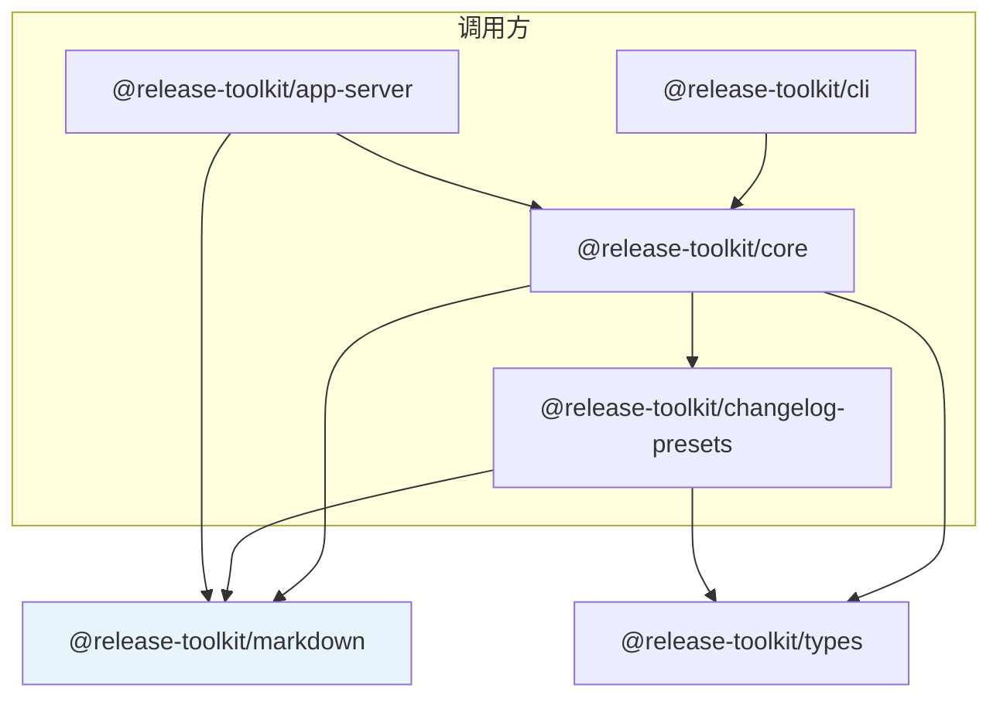

# 共享 Markdown 模块详解 (@release-toolkit/markdown)

## 职责定位

`@release-toolkit/markdown` 是 **零运行时环境依赖** 的纯字符串工具包（无 `fs`、无 `git`、无 `octokit`），用于统一：

- PR / 评论中的 **列表与标题** 渲染
- **RELEASE-LOG** 标记区解析
- **RELEASE-TOOLKIT-OUTPUT** 描述体幂等更新
- Conventional Commit **emoji 前缀**

避免 `@release-toolkit/core` 与 `@release-toolkit/app-server` 各维护一份相同逻辑导致行为漂移。

---

## 在整体架构中的位置



| 调用方 | 使用的 API | 说明 |
|--------|------------|------|
| **core** `package-log-format.ts` | `formatTitleBulletLine`、`formatChangeLogBulletsFromBody` | 在 markdown 基础上叠加 changelog **插件** `formatLine` |
| **core** `release-log-extractor.ts` | `extractReleaseLogFromBody`、`parseReleaseLog` | 支持自定义 `releaseLogMarker` |
| **core** `collector.ts` | `upsertOutputInBody` | 写入 PR 描述体（含说明引用块） |
| **core** `previewer.ts` | `OUTPUT_MARKERS`、`escapeRegex` | 从已合并 PR body 提取 OUTPUT 区 |
| **app-server** `format.ts` | `formatTitleBulletWithEmoji`、`formatChangeLogBulletsPlain`、评论组装 | Worker 无插件，走内置 emoji |
| **app-server** `format.ts` | `upsertOutputInBody` | Approve 后写入 PR 描述体 |
| **changelog-presets** | `COMMIT_TYPE_EMOJI`（再导出） | 与 `applyEmojiPrefixToLine` 同源 |

> **core** 仍通过 `shared/utils.ts` **再导出** markdown 的部分符号（`OUTPUT_MARKERS`、`escapeRegex` 等），旧代码可继续 `import { OUTPUT_MARKERS } from '@release-toolkit/core'`。

---

## 模块结构

```
packages/markdown/src/
├── markers.ts           # HTML 注释锚点常量
├── emoji.ts             # COMMIT_TYPE_EMOJI + applyEmojiPrefixToLine
├── bullets.ts           # toBulletLines、空日志占位
├── title-bullet.ts      # 标题行（含/不含 formatLine）
├── changelog-bullets.ts # 变更日志列表（含/不含 body 转换）
├── parse-release-log.ts # ## 包名 分组解析
├── extract-release-log.ts
├── output-body.ts       # wrapOutputMarkers / upsertOutputInBody
├── escape.ts
└── index.ts
```

---

## 标记常量

| 常量 | 用途 | 读写方 |
|------|------|--------|
| `RELEASE_LOG_START` / `RELEASE_LOG_END` | 用户在 PR 描述体中编辑的变更日志区 | 用户写、collect 读 |
| `OUTPUT_START` / `OUTPUT_END` | 工具写入 PR 描述体的结构化输出 | collect / App Server 写 |
| `OUTPUT_MARKERS` | `{ START, END }` 对象，兼容 core 历史 API | preview 聚合已合并 PR |
| `COMMENT_ANCHOR_START` / `END` | PR 评论 upsert 锚点 | App Server |

---

## 核心 API 说明

### 列表与标题

```typescript
// 文本 → bullet 列表（已有 `-` 不重复加前缀）
toBulletLines('行一\n行二')  // ['- 行一', '- 行二']

// 标题行（App Server：内置 emoji）
formatTitleBulletWithEmoji('feat: 登录')  // '- ✨ feat: 登录（标题）'

// 标题行（Core：接插件 formatLine）
formatTitleBulletLine('feat: 登录', (line) => emojiPrefix.formatLine(line))

// 变更日志（App Server）
formatChangeLogBulletsPlain('feat: A\nfix: B')

// 变更日志（Core：先走 parseChangelog + applyFormatters）
formatChangeLogBulletsFromBody(raw, (body) => applyFormatters(...))
```

### RELEASE-LOG 解析

支持的写法（与 [06-workflows.md](./06-workflows.md) 示例一致）：

1. `## package-a, package-b` + 列表项（推荐）
2. 兼容旧格式：跳过 `### 标题` / `### 变更日志` 等子标题
3. 无 `##` 时整段作为「通用变更日志」

```typescript
const { packageChangeLogs, rawReleaseLog } = extractReleaseLogFromBody(prBody);
// 或自定义标记：
extractReleaseLogFromBody(body, { start: '<!-- CUSTOM-START -->', end: '...' });
```

### PR 描述体 OUTPUT 区

```typescript
// 包裹
wrapOutputMarkers(inner)  // <!-- RELEASE-TOOLKIT-OUTPUT-START --> ...

// 幂等更新（无标记区 → 追加；有 → 替换）
upsertOutputInBody(currentBody, innerContent);
upsertOutputInBody(body, inner, { replaceAll: true });  // core collector 全局替换
```

---

## Core vs App Server 渲染差异

| 能力 | Core（CI / `collectPRLog`） | App Server（Worker 评论） |
|------|---------------------------|---------------------------|
| 标题 emoji | 依赖 `plugins`（如 `emoji-prefix`） | 内置 `applyEmojiPrefixToLine` |
| 变更日志格式化 | `parseChangelog` + `applyFormatters` | `formatChangeLogBulletsPlain` |
| PR 描述体更新 | `upsertOutputInBody` + 说明引用块 | `upsertOutputInBody`（无额外说明块） |
| 评论结构 | — | `buildPRComment`（通知 / 预览 / 指南） |

两者输出的 **bullet 结构与 `## 包名` 分组语义一致**，差异仅在是否加载 changelog 插件。

---

## 依赖与构建

```json
{
  "name": "@release-toolkit/markdown",
  "dependencies": {}
}
```

- 无 workspace 运行时依赖（不依赖 `@release-toolkit/types`，保持最小包体）
- Cloudflare Worker 与 Node CI 均可直接打包

```bash
pnpm --filter @release-toolkit/markdown test
pnpm --filter @release-toolkit/markdown build
```

---

## 扩展指南

| 需求 | 建议 |
|------|------|
| 新增 commit type emoji | 改 `src/emoji.ts` 的 `COMMIT_TYPE_EMOJI`，changelog-presets 自动同源 |
| 新增 RELEASE-LOG 格式 | 优先扩展 `parse-release-log.ts` 并补 vitest |
| 评论 / 描述体新锚点 | 在 `markers.ts` 增加常量，勿在 core/app-server 硬编码 |
| 复杂 changelog 变换 | 放在 **core 插件** 或 `formatChangeLogBulletsFromBody` 的 `transformBody`，不要塞进 Worker |

---

## 相关文档

- [02-core-module.md](./02-core-module.md) — `package-log-format`、`release-log-extractor`
- [05-app-server.md](./05-app-server.md) — 评论组装与 `version-resolve`
- [06-workflows.md](./06-workflows.md) — 端到端 PR 生命周期与数据流
- [07-config-and-plugin.md](./07-config-and-plugin.md) — `logExtraction`、`plugins` 配置
