# 发布计划中心架构

> 本文是 Release Toolkit 的目标架构设计，重点解决“日志收集、日志格式化、发布选择、版本计算、workspace 依赖联动、实际发布”之间的职责混杂问题。
>
> 当前仓库已经实现 `collect`、`preview`、`publish` 三条能力线；本文描述如何将它们统一到 Release Plan（发布计划）模型中。文中标记为“目标”的内容属于后续设计，不代表当前代码已经全部支持。实际实施顺序、数据契约和验收以 [Release Plan v1 可执行实施规格](../implementation/README.md) 为准。

## 1. 设计目标

Release Toolkit 不应该直接从 Git diff 推导并发布所有发生变化的 package，而应该经历以下过程：

```mermaid
flowchart LR
    A["Feature PR"] --> B["声明公开日志 / 内部变更 / 不发版"]
    B --> C["标准化 Change Entry"]
    C --> D["合并后进入 Release Queue"]
    D --> E["网页触发 Prepare Release"]
    E --> F["生成或刷新 Release Plan"]
    F --> G["选择 package、版本与依赖联动"]
    G --> H["Release PR 预览和临时覆盖"]
    H --> I["合并 Release PR"]
    I --> J["按锁定计划发布"]
    J --> K["成功后消费 Change Entry"]
```

核心原则：

1. 日志描述“改了什么”，不直接决定发布范围。
2. 版本解析决定“应该升到什么版本”，不负责真正发布。
3. Release Plan 决定“这次发布哪些 package”。
4. Publisher 只执行已经确认的 Release Plan，不重新猜测发布范围。

## 2. 当前实现与目标架构的差异

| 领域           | 当前实现                                   | 目标架构                                                          |
| -------------- | ------------------------------------------ | ----------------------------------------------------------------- |
| 日志来源       | 以 PR body / comment 和快照为主            | 多来源统一为 `LogEntry`                                           |
| 日志存储       | PR 快照与 Markdown 输出并存                | 原始日志、结构化日志、渲染结果分层存储                            |
| package 识别   | 依赖 package.json 及版本差异               | 根据变更文件所属 workspace package 识别，不要求 Feature PR 改版本 |
| 单条格式化     | `ChangelogFormatter.formatLine` 已支持     | 明确为 `formatEntry` 插件能力                                     |
| 整周期格式化   | 聚合逻辑分散在 preview / markdown          | 由 `formatRelease(plan)` 统一负责                                 |
| 发布范围       | `publish` 直接发布检测到版本变化的 package | 由 Release Plan 显式选择                                          |
| 版本控制       | 主要从 package 版本差异检测                | 支持自动、手动、固定、独立、预发布策略                            |
| workspace 依赖 | 可读取 workspace patterns                  | 建立依赖图并按开关自动关联 dependents                             |
| 配置           | 按功能分组，但发布决策较少                 | 配置长期策略，Release Plan 保存本次决策                           |
| 发布执行       | 扫描后直接创建 Tag / Release               | 只执行已确认计划，支持恢复与审计                                  |

## 3. 领域模型

### 3.1 LogEntry：结构化日志

所有来源先转换成统一的日志条目：

| 字段            | 作用                               |
| --------------- | ---------------------------------- |
| `packageNames`  | 日志适用的 package，可为空         |
| `type`          | feat、fix、docs 等变更类型         |
| `scope`         | 可选的模块范围                     |
| `subject`       | 简短变更标题                       |
| `body`          | 详细说明                           |
| `source`        | pr、commit、comment、file 等来源   |
| `sourceId`      | 来源唯一标识，如 PR 编号           |
| `visibility`    | `public`、`internal` 或 `hidden`   |
| `releaseIntent` | `release` 或 `none`，必须显式声明  |
| `status`        | `pending`、`planned` 或 `consumed` |
| `metadata`      | 插件或平台扩展字段                 |

没有明确 package 的日志，先标记为 shared / unresolved，由 package 解析策略在生成 Release Plan 时处理，不要在收集阶段武断复制到所有 package。

### 3.2 PackageCandidate：发布候选项

候选项表示“这个 package 可能需要发布”，但还不是最终决定：

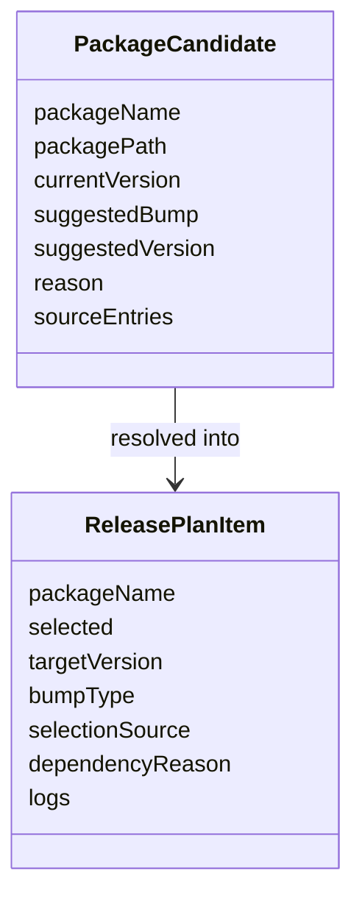

### 3.3 ReleasePlan：唯一的发布决策

Release Plan 是一次发布的完整快照，至少包含：

- 计划 ID、生成时间、目标分支和 commit SHA；
- 所有候选 package；
- 最终选择发布的 package；
- 每个 package 的当前版本和目标版本；
- 用户主动选择与依赖自动关联的来源；
- 版本策略和 workspace 关联策略；
- 渲染后的 changelog 或渲染所需的结构化日志；
- plan 状态：`draft`、`previewed`、`confirmed`、`publishing`、`published`、`failed`。

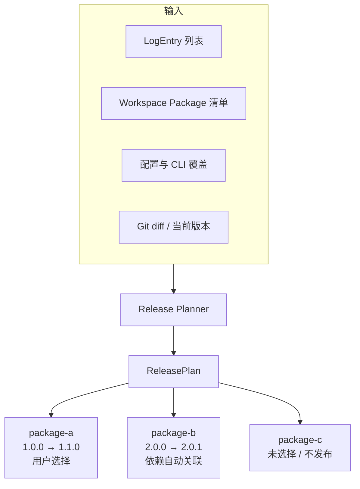

## 4. 日志处理架构

日志处理分为收集、解析、单条格式化、整周期格式化四个阶段：

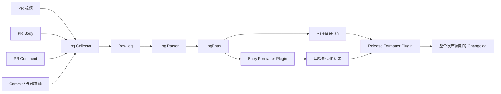

### 单条日志格式化

插件只处理一条结构化日志及上下文，例如：

- 添加 emoji；
- 修改类型名称；
- 添加 package 前缀；
- 隐藏内部 metadata；
- 将标题、正文转换为统一 Markdown。

### 整个发布周期格式化

整体格式化器接收 Release Plan，负责：

- 按 package 分组；
- 按变更类型分组；
- 合并多个 PR 的重复或关联日志；
- 生成 GitHub Release body；
- 生成 CHANGELOG 文件；
- 生成 PR 预览评论。

两者必须分开：单条格式化器不应该决定发布范围，整体格式化器也不应该修改版本选择。

## 5. 发布计划生成流程

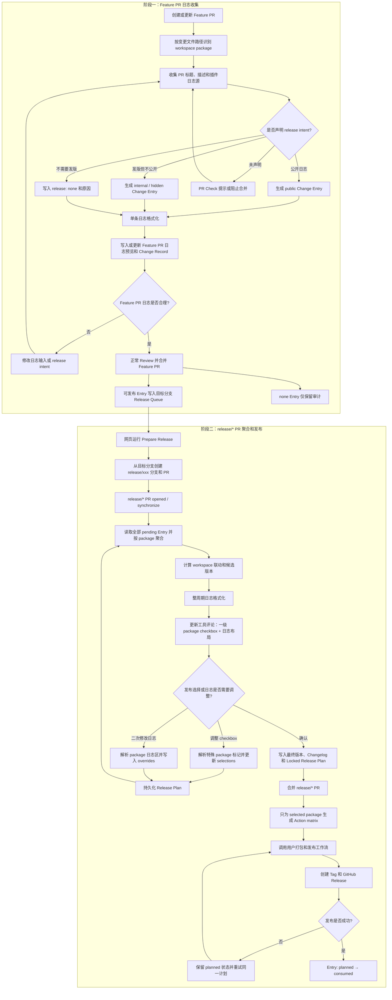

## 6. package 选择策略

发布范围应支持以下来源，并明确优先级：

```text
默认策略
  < 仓库配置
  < 环境配置
  < Release Plan 文件
  < CLI 临时参数
```

建议支持：

| 策略          | 说明                                           |
| ------------- | ---------------------------------------------- |
| `auto`        | 根据日志和版本策略生成候选项                   |
| `include`     | 强制包含指定 package                           |
| `exclude`     | 强制排除指定 package                           |
| `only`        | 本次只允许发布指定 package                     |
| `manual`      | 目标版本必须由用户指定                         |
| `all-changed` | 兼容当前行为，发布所有检测到版本变化的 package |

当用户只想发布一个 package 时，其他 package 应保留在候选列表中但标记为 `selected: false`，而不是从数据中删除。这样预览和审计仍然能解释为什么没有发布它们。

### 6.1 PR 不需要出现在 Release 日志时

“不写 Release 日志”必须区分两种情况：

| 情况                               | 声明                               | 结果                                           |
| ---------------------------------- | ---------------------------------- | ---------------------------------------------- |
| 不需要发布任何 package             | `release: none`                    | 不进入 Release Queue，但保留原因用于审计       |
| package 需要发布，但不展示公开日志 | `visibility: internal` 或 `hidden` | 参与版本和依赖计算，但不进入公开 Release Notes |

不建议把“没有 Change Entry”直接理解为“不需要日志”，否则无法区分开发者遗漏和主动跳过。PR Check 应要求以下二选一：提供 Change Entry，或者明确声明 `release: none`。

概念示例：

```yaml
id: pr-123
release: none
reason: 只修改测试和内部 CI，不影响发布产物
```

需要发布但不公开日志时：

```yaml
id: pr-124
release: release
changes:
  - id: pr-124-core
    package: '@release-toolkit/core'
    bump: patch
    visibility: internal
    title: 内部安全加固
```

### 6.2 只通过网页触发发版

默认入口应是 GitHub Actions 的 `workflow_dispatch`，而不是要求维护者在本地同步 main/dev 分支。建议提供 `Prepare Release` 工作流，并在网页表单中支持：

- 目标发布分支；
- package 范围：全部、指定 package 或沿用已有 Release PR；
- stable、beta、rc 等发布通道；
- 是否启用 workspace 自动关联；
- dry-run 或正式创建 Release PR。

工作流始终从远程目标分支 checkout 最新代码，创建 `release/<release-id>` 分支并生成或更新一个 Release PR。维护者只需要在 GitHub 网页检查并合并该 PR；Release PR 合并后，另一个受保护的 publish workflow 才执行真正发布。

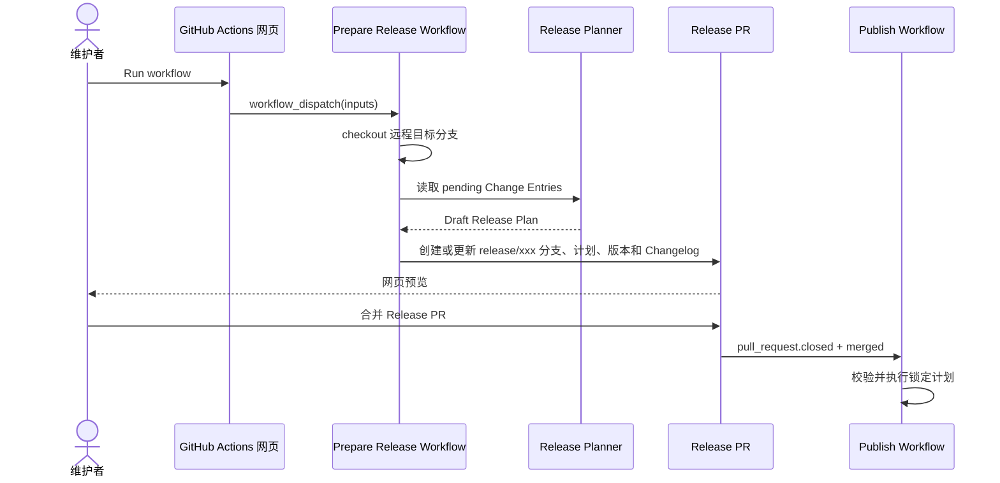

也可以为 GitHub App 增加 `/release prepare` 评论命令，但它应该只触发同一个 workflow，不能在 App Server 中复制一套 Planner。

### 6.3 临时修改 Release 日志

不建议直接编辑生成后的 `CHANGELOG.md` 或 GitHub Release body，因为下一次 refresh 会覆盖它。一次发版的临时修改应写入 Release Plan 的 override 层：

```yaml
overrides:
  pr-123-core:
    title: 调整后的公开标题
    details:
      - 合并重复说明后的内容
    visibility: public
```

维护者可以直接在 GitHub 网页编辑 Release PR 中的计划文件并提交。格式化顺序是：

```text
原始 Change Entry
  → Release Plan override
  → 单条格式化插件
  → 整周期格式化插件
  → CHANGELOG / GitHub Release body
```

refresh 时必须保留 override；如果原始 Entry 在此期间发生变化，应提示冲突，不能静默覆盖维护者的临时修改。

### 6.4 在 Release PR 上刷新仓库已有 Change Entries

建议提供两个网页入口，它们执行同一个幂等刷新动作：

1. GitHub Actions 中运行 `Prepare Release`，填写已有 Release PR 编号；
2. 在 Release PR 评论 `/release refresh`，由 GitHub App 校验权限后触发 workflow。

刷新过程：

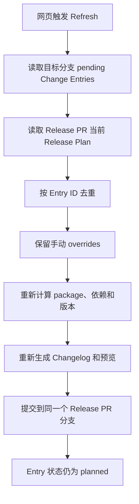

这里“刷新进 Release PR”和“消费”必须分开：

- `pending → planned`：Entry 已进入某个 Release Plan，可以继续修改和刷新；
- `planned → consumed`：只有 package、Tag 和 Release 全部成功后发生；
- 发布失败：保持 `planned`，允许按同一个 Release Plan 重试；
- 未选中的 package Entry：继续保持 `pending`，留到下一次发版。

如果一个 Change Record 同时包含多个 package，应以 Entry ID 为粒度消费，不能因为其中一个 package 已发布就删除整个 Change Record。

### 6.5 `release/*` PR 的触发规则

Feature PR 不应该修改 package 版本。它只需要根据 Git diff 中的文件路径匹配 workspace package 根目录，例如 `packages/core/src/a.ts` 归属 `@release-toolkit/core`。版本字段由 Release Planner 在 Release PR 中统一更新。

`release/*` 应作为 Release PR 的来源分支约定：

| 事件                                           | 行为                                                          |
| ---------------------------------------------- | ------------------------------------------------------------- |
| Feature PR opened / synchronize                | 检测受影响 package，校验 Change Entry，不计算最终版本         |
| Feature PR merged                              | Change Entry 进入 pending 队列，不立即发包                    |
| `release/*` PR opened / synchronize / reopened | 聚合 pending Entry，生成 package checkbox、版本和完整日志预览 |
| `release/*` PR merged                          | 读取锁定 Release Plan，执行真正发布                           |
| 普通分支 PR merged                             | 永远不触发真正发布                                            |

这里需要区分“日志预览”和“实际发布”：创建 `release/*` PR 时可以生成候选 Release Notes；只有合并该 PR 才允许发布 package、Tag 和 GitHub Release。

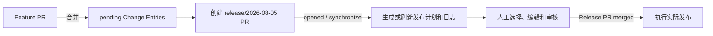

GitHub Actions 的 `pull_request.branches` 过滤的是目标分支，不是来源分支。因此识别 Release PR 时，应额外校验 head ref 是否以 `release/` 开头；不能只配置 `branches: [release/**]`。

### 6.6 一级 package checkbox 与发布 Action 过滤

Release PR 评论只提供一级 package checkbox，默认选中所有存在 pending Entry 的 package。package 下方日志只负责布局展示和二次修改，不再使用子 checkbox：

```markdown
<!-- release-toolkit:selection:start plan="release-2026-08-05" revision="3" -->

- [x] <!-- release-toolkit:package key="pkg-core" --> @release-toolkit/core：1.2.0 → 1.3.0

  <!-- release-toolkit:log:start key="pkg-core" -->
  - 新增批量日志格式化
  - 调整内部诊断输出
  <!-- release-toolkit:log:end key="pkg-core" -->

- [ ] <!-- release-toolkit:package key="pkg-cli" --> @release-toolkit/cli：2.0.0 → 2.0.1

  <!-- release-toolkit:log:start key="pkg-cli" -->
  - 增加命令行入口
  <!-- release-toolkit:log:end key="pkg-cli" -->

<!-- release-toolkit:selection:end -->
```

checkbox 语义：

- package checkbox 控制这个 package 本次是否进入发布矩阵；
- package 被取消后，其全部 Entry 继续保持 `pending`，留到后续发版；
- package 下方日志不参与 checkbox 判断，只作为预览和 override 编辑区；
- 如需隐藏或调整某一条日志，通过 package 日志区生成 override，而不是增加第二级 checkbox；
- workspace 自动关联的 package 要显示关联原因；若允许手动取消，必须同时显示风险警告。

checkbox 必须携带特殊标记，不能依赖显示文本或普通 Markdown task list。解析器只接受同时满足以下条件的内容：

1. 评论具有 release-toolkit 工具评论锚点；
2. checkbox 位于 `selection:start/end` 区域；
3. checkbox 行包含合法的 `release-toolkit:package key`；
4. `plan`、`revision` 和 package key 能在当前 Release Plan 中匹配；
5. 操作者拥有配置要求的仓库权限。

日志正文中的普通 `- [ ]`、用户其他评论以及未知 package key 一律忽略。出现重复 key、缺失标记或过期 revision 时，不应猜测结果，而应拒绝这次更新并重新渲染评论。

评论不能成为唯一事实源。点击 checkbox 或修改 package 日志区后，GitHub App 或 Action 应把 package 选择和日志 override 写入 Release Plan。重新渲染评论时，以 Release Plan 为准。

平台约束：GitHub 官方文档说明 task list checkbox 可点击、`issue_comment` 有 `edited` 事件，但未明确保证维护者可以修改 GitHub App 作者的评论。实施前必须在真实仓库验证该交互；selection 协议应与承载位置解耦，必要时可配置在 Release PR Body 中使用同一套 marker 和 parser。

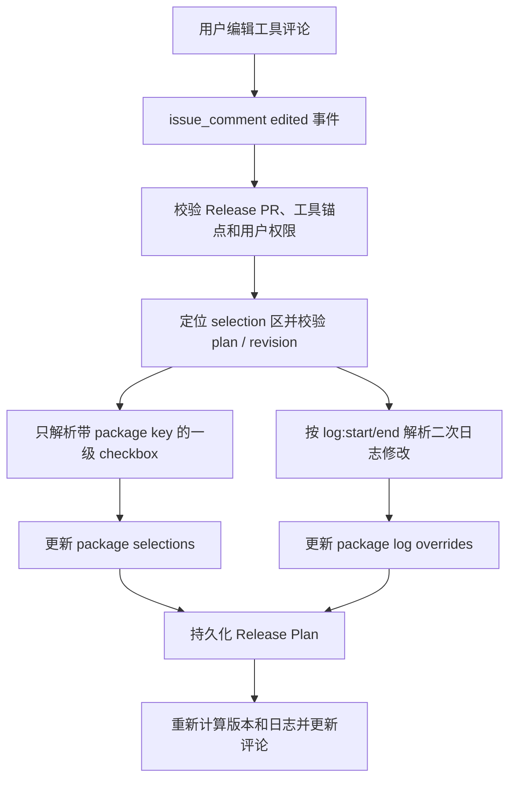

发布 Action 不应再次解析 checkbox，而应只读取合并 commit 中锁定的 Release Plan，并输出过滤后的矩阵：

| 输出                     | 用途                                      |
| ------------------------ | ----------------------------------------- |
| `hasPublishablePackages` | 没有选中 package 时跳过全部打包和发布 job |
| `packageMatrix`          | 只包含 `selected: true` 的 package        |
| `releasePlanPath`        | 用户工作流读取完整计划、日志和依赖原因    |
| `channel`                | stable、beta、rc 等发布通道               |
| `planId`                 | 日志、构建产物和发布结果的关联 ID         |

每个 matrix item 至少传递：`packageName`、`packagePath`、`currentVersion`、`targetVersion`、`includedEntryIds`、`selectionReason`。仓库维护者可以用这些输入决定是否运行自定义打包、Registry 发布或部署工作流；未选中的 package 根本不进入 matrix，从源头跳过对应 Action job。

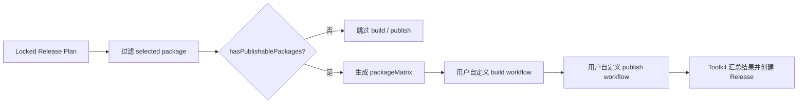

## 7. workspace 依赖联动

先读取每个 workspace package 的 manifest，建立依赖图：

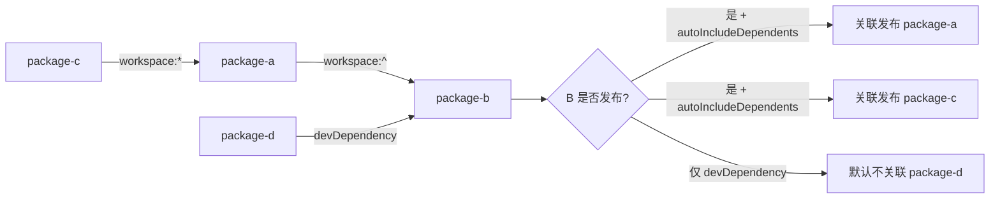

建议默认策略：

- 自动关联依赖已发布 package 的 `dependents`；
- `devDependencies` 默认不触发发布；
- `peerDependencies` 由单独开关控制；
- 不自动发布被当前 package 依赖的所有 dependencies；
- 自动关联的 package 必须在预览中显示原因；
- 关联结果可以被用户排除，但需要显示风险提示。

配置概念：

```text
workspace:
  enabled: true
  autoIncludeDependents: true
  autoIncludeDependencies: false
  includePeerDependents: false
  updateDependencyRanges: true
```

## 8. 版本解析策略

版本解析独立于 Publisher，支持：

- `auto`：由日志类型推导 major / minor / patch；
- `manual`：用户指定目标版本；
- `independent`：每个 package 独立版本；
- `fixed`：一组 package 使用相同版本；
- `linked`：相关 package 按规则同步版本；
- `prerelease`：alpha、beta、rc 通道。

版本决策优先级：

```text
ReleasePlan 明确版本
  > CLI 指定版本
  > package 配置
  > workspace 依赖联动产生的 bump
  > 日志推导的 bump
```

发布前必须校验：目标版本高于当前版本、Tag 不冲突、依赖范围可满足、plan 对应的 commit 没有变化。

## 9. 配置边界

建议将配置按职责拆分：

```text
branches       分支与触发条件
log            日志来源、标记、解析规则
packages       package 默认发布策略
workspace      workspace 扫描与依赖联动
versioning     版本计算策略
formatting     单条与整周期输出策略
publishing     Tag、GitHub Release、Registry 发布
plugins        插件加载与顺序
hooks          发布前后外部动作
```

配置负责长期规则；Release Plan 负责某一次发布的实际决定。不要把一次发布的 package 选择永久写入全局配置。

## 10. 发布器边界

Publisher 只做以下事情：

1. 读取已确认的 Release Plan；
2. 校验当前 commit、版本和依赖状态；
3. 按顺序创建 Git Tag；
4. 创建 GitHub Release；
5. 调用 registry publish 或外部 hooks；
6. 保存每个 package 的结果和失败原因。

Publisher 不应该：

- 重新扫描并决定发布范围；
- 隐式修改用户已经确认的版本；
- 根据日志格式推断依赖关系；
- 在部分失败后静默继续并报告整体成功。

## 11. 推荐的演进顺序

1. 定义 `LogEntry`、`ReleasePlan`、`ReleasePlanItem` 和状态模型。
2. 将当前 PR 快照统一转换为结构化日志，并保留原始内容用于审计。
3. 拆分单条格式化与整周期格式化插件边界。
4. 将 Feature PR 的 package 检测改为文件路径归属，不再要求 Feature PR 修改版本。
5. 增加 `release/*` PR 识别、Prepare Release 网页入口和 Release Plan 持久化。
6. 增加带特殊标记的一级 package checkbox、权限校验和幂等刷新。
7. 增加 package 选择、排除、手动版本覆盖以及 workspace 自动关联。
8. 让 `preview` 展示完整 Release Plan，而不只是版本 diff。
9. 让 `publish` 只为 selected package 生成矩阵并执行锁定计划。
10. 最后再扩展配置继承、更多日志来源和更多发布平台。

## 12. 验收标准

完成目标架构后，至少应能回答以下问题：

- 这条日志来自哪个 PR，影响哪些 package？
- Feature PR 未修改 package 版本时，能否仍然正确识别受影响 package？
- 为什么这个 package 被选中或被排除？
- 目标版本是用户指定、日志推导还是依赖联动产生的？
- 哪些 package 是 workspace 依赖自动关联的？
- 是否只有 `release/*` PR 合并才会触发真正发布？
- 一级 package checkbox 是否只解析工具选择区中的特殊标记，并持久化到 Release Plan？
- 未选中的 package 是否完全不会进入 build / publish Action matrix？
- 单条日志和整个发布周期的输出是否使用同一份结构化数据？
- 发布失败后能否从 Release Plan 恢复或重试？
- Publisher 是否只执行确认过的发布范围？
