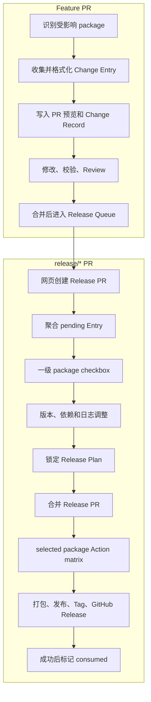

# Release Plan v1 可执行实施规格

> 状态：目标实施规格，尚未由当前代码完整实现。
>
> 本文是交给 AI 或开发者执行 Release Toolkit 重构的唯一任务入口。实现过程中不得缩减需求、把目标能力描述为已完成，或用现有测试未覆盖某项需求作为跳过理由。

需要直接委派给另一个 AI 时，可使用 [AI_PROMPT.md](./AI_PROMPT.md)。

## 1. 最终目标

将当前 `collect → preview → publish` 的隐式发布流程改造成两个明确阶段：

1. Feature PR 阶段负责收集、校验、格式化和保存每个 package 的 Change Entry。
2. `release/*` PR 阶段负责聚合待发布 Entry、选择 package、计算版本和 workspace 联动、编辑整周期日志，并在合并后执行锁定计划。



## 2. 不可变产品决策

以下决策为 v1 固定契约：

1. Feature PR 不要求、也不应为了工具而修改 package 版本。
2. 受影响 package 通过变更文件所属 workspace package 根目录识别。
3. 一个 Change Entry 只属于一个 package；一个 PR 影响多个 package 时创建多个 Entry。
4. PR 必须明确提供可发布 Entry 或 `release: none`，不能用缺失数据表示主动跳过。
5. `release/*` 是 Release PR 的来源分支模式；普通 PR 合并永远不执行实际发布。
6. Release PR 打开或更新只生成/刷新发布计划；合并 Release PR 才执行发布。
7. Release PR 评论只提供一级 package checkbox，默认选中。
8. checkbox 必须携带工具特殊标记，并持久化到 Release Plan；评论不是事实源。
9. package 下方日志用于展示和二次修改，不提供 Entry 级 checkbox。
10. 未选 package 的 Entry 保持 pending；选中 package 的 Entry 被快照进 Locked Plan。
11. Publisher 只执行 Locked Plan，不重新扫描发布范围或重新计算版本。
12. 发布失败只能重试同一个 plan；成功后 Entry 才是 consumed。
13. workspace 自动关联可配置，结果和原因必须出现在预览与计划中。
14. 未选 package 不进入 Action matrix，从源头跳过对应打包和发布 job。

## 3. 功能需求

### FR-01 Feature PR package 识别

- 读取 workspace 配置和每个 package manifest。
- 将 Git diff 文件按最长 package 根路径匹配到 package。
- package 内任意源码、资源或 manifest 变化都能识别；不检查 version 是否变化。
- 根目录共享文件通过配置映射、插件或 `release: none` 处理，不能默认归属所有 package。

### FR-02 Release intent

每个 Feature PR 必须满足一种状态：

- `release` + public Entry；
- `release` + internal/hidden Entry；
- `none` + 非空原因。

严格模式下未声明应让 PR Check 失败；宽松模式只警告。

### FR-03 Change Entry 存储

- 规范目录：`.release-toolkit/changes/`。
- 一个文件只保存一个 package Entry，文件名和 Entry ID 唯一。
- Entry ID 在所有刷新、格式化、计划和发布结果中保持稳定。
- 原始日志、结构化字段和来源元数据分离，不把最终 Markdown 作为数据源。

### FR-04 Feature PR 日志循环

- PR opened、reopened、synchronize、edited 时重新收集。
- 单条 formatter 在写预览前执行。
- 工具幂等更新自己的评论或输出区。
- 用户修改来源后可以 refresh；旧预览不能被误当成新输入。
- Feature PR 合并后，Change Entry 随目标分支进入 Release Queue。

### FR-05 兼容旧 RELEASE-LOG

- 旧 Marker 解析仅作为兼容输入适配器。
- 解析结果必须立即转换为 Change Entry。
- Body、评论和工具输出不能继续作为并列事实源。
- 支持配置关闭 legacy marker；关闭后仅接受 Change Entry。

### FR-06 网页创建 Release PR

- 提供 GitHub Actions `workflow_dispatch` 的 `Prepare Release` 工作流。
- 工作流从远程目标分支 checkout 最新代码，不要求本地同步。
- 创建或更新 `release/<release-id>` 分支和 Release PR。
- 输入至少支持目标分支、release ID、发布通道、package 范围、workspace 联动开关、dry-run、已有 Release PR 编号。

### FR-07 Release PR 识别

- 目标分支必须匹配配置的 release base。
- 来源分支必须匹配 `release/*`；GitHub `branches` 不能替代 head ref 校验。
- opened、reopened、synchronize 触发 plan refresh。
- merged 触发 publish；closed-unmerged 不发布并释放 draft plan。

### FR-08 一级 checkbox

- 每个候选 package 一行 checkbox，默认选中。
- checkbox 行包含稳定 opaque package key，不使用显示包名作为主键。
- 只解析工具评论、selection 区、当前 plan/revision 和合法 key。
- 普通 task list、日志正文 checkbox、未知或重复 key 全部忽略或拒绝。
- 只有满足权限策略的用户可以修改发布选择。
- selection renderer/parser 不依赖具体承载位置；主承载位置是工具评论，配置可切换到 Release PR Body 作为平台兼容回退。

GitHub 官方文档确认 task list checkbox 可点击，且 `issue_comment` 支持 `edited` activity，但没有在该文档中承诺维护者可修改 GitHub App 所创建评论中的 checkbox。P0 必须在真实测试仓库验证“App 评论 → 维护者点击 → edited webhook → sender/权限”完整链路。在验证通过前，这一交互不得标记完成：

- [About tasklists](https://docs.github.com/en/get-started/writing-on-github/working-with-advanced-formatting/about-tasklists)
- [Events that trigger workflows: issue_comment](https://docs.github.com/en/actions/reference/workflows-and-actions/events-that-trigger-workflows#issue_comment)

### FR-09 Release 日志二次修改

- package 日志区具有独立 start/end 标记。
- 修改后的文本写入 `ReleasePlan.overrides`，不修改原始 Entry。
- refresh 保留 overrides。
- 原始 Entry 变化且与 override 冲突时必须显式报错。
- 生成顺序固定为 Entry → override → entry formatter → release formatter。

### FR-10 Release Queue 刷新

- `Prepare Release` 指定已有 PR，或 `/release refresh`，触发同一套 refresh workflow。
- 按 Entry ID 幂等去重。
- 未选 package Entry 继续 pending。
- 已被其他 Locked Plan 占用的 Entry 不得再次进入新计划。

### FR-11 workspace 依赖图

- 解析 dependencies、optionalDependencies、peerDependencies、devDependencies 中的 workspace package 引用。
- 默认关联 selected package 的 runtime dependents。
- dev dependents 默认不关联；peer dependents 单独配置。
- 支持递归关联与循环图检测。
- 自动关联项记录 dependency path、dependency type 和 selection reason。

### FR-12 版本解析

- 当前版本来自 release base 上的 package manifest。
- 目标版本只在 Release Planner 中计算。
- 支持 major、minor、patch、manual、prerelease、fixed、independent、linked。
- 优先级：plan override > workflow input > package config > dependency bump > Entry bump。
- Release PR 写入最终 package 版本和必要的 workspace dependency range。

### FR-13 Release Plan 生命周期

状态至少包括：`draft`、`previewed`、`locked`、`publishing`、`published`、`failed`、`cancelled`。

- draft/previewed 可以刷新。
- Release PR 合并时生成不可变 locked snapshot，包含 commit SHA 和配置快照。
- locked 后不能通过评论改变选择或日志。
- failed 只能以相同 plan ID 和 snapshot 重试。
- published 后记录每个 package 的 Tag、Release URL 和 workflow result。

### FR-14 Action 过滤契约

Planner 输出：

- `hasPublishablePackages`；
- `packageMatrix`；
- `releasePlanPath`；
- `planId`；
- `channel`。

matrix 只包含 selected package。每项至少含 packageName、packagePath、currentVersion、targetVersion、includedEntryIds、selectionReason、dependencyReasons。

### FR-15 Publisher

- 只读取 Locked Plan。
- 执行前校验 plan SHA、当前 merge commit、版本、Tag 冲突和依赖范围。
- 每个 package 的 build/publish 结果独立记录。
- 未选 package 不执行 beforeTag、Tag、Registry publish、GitHub Release 或 package hook。
- 部分失败不能报告整体成功。

### FR-16 消费语义

- pending：Change Entry 尚未进入 Locked Plan。
- planned：Entry 已被 Locked Plan 快照，不再进入其他计划。
- consumed：对应 package 发布成功。
- failed：保留在原 Locked Plan 中等待重试，不退回新计划。
- Release PR 中未选 package 的文件留在 `.release-toolkit/changes/`。
- Release PR lock 时，将选中 Entry 的完整快照写入 `.release-toolkit/plans/<plan-id>/plan.json` 和 `entries/`，并在该 Release PR 中移除对应 pending 文件；Release PR 未合并时目标分支队列不受影响。
- 发布结果写入 GitHub Release/Check，并可由 API 按 plan ID 查询；失败 plan 继续引用已锁定快照，不重新从 queue 生成。

### FR-17 插件

插件边界固定分为：

- ChangeSource：产生原始日志；
- ChangeParser：转换为 Change Entry；
- EntryFormatter：格式化单条 Entry；
- ReleaseFormatter：格式化整个 Release Plan；
- ReleaseHook：外部动作。

插件不得隐式改变 package selection 或 targetVersion；策略扩展必须通过明确的 Planner policy 接口。

### FR-18 安全和并发

- Webhook 必须验证签名。
- checkbox 修改校验 actor 权限、comment anchor、plan ID、revision 和 package key。
- 同一个 Release PR 的 refresh 使用 concurrency group 串行化。
- stale revision、重复 delivery 和重复 workflow 必须幂等。
- 外部 PR/fork 不得获取发布 secret 或执行 publish。

## 4. 数据契约

### 4.1 Change Entry

以下是字段契约，不是要求照抄的实现代码：

```typescript
type ChangeEntry = {
  schemaVersion: 1;
  id: string;
  source: { type: 'pull-request'; number: number; sha: string };
  packageName: string;
  packagePath: string;
  bump: 'major' | 'minor' | 'patch' | 'none';
  visibility: 'public' | 'internal' | 'hidden';
  title: string;
  details: string[];
  metadata?: Record<string, unknown>;
};
```

`release: none` 使用独立 NoReleaseRecord，必须包含 PR、SHA 和 reason，不伪造成 package Entry。

### 4.2 Release Plan

```typescript
type ReleasePlan = {
  schemaVersion: 1;
  id: string;
  revision: number;
  status: 'draft' | 'previewed' | 'locked' | 'publishing' | 'published' | 'failed' | 'cancelled';
  baseBranch: string;
  releaseBranch: string;
  headSha: string;
  channel: string;
  configSnapshot: Record<string, unknown>;
  packages: ReleasePlanPackage[];
  overrides: Record<string, PackageLogOverride>;
};
```

每个 ReleasePlanPackage 包含 selected、当前/目标版本、直接 Entry、自动关联原因、依赖变更、格式化日志和执行结果。

### 4.3 仓库目录

```text
.release-toolkit/
├── config.json
├── changes/                    # pending，一文件一个 package Entry
│   └── pr-123-core.yml
├── no-release/                 # 可选审计记录
│   └── pr-124.yml
└── plans/
    └── release-2026-08-05/
        ├── plan.json           # draft/locked plan
        └── entries/            # selected Entry 快照
```

## 5. 模块目标

| package             | 必须完成的目标                                                                                          |
| ------------------- | ------------------------------------------------------------------------------------------------------- |
| `types`             | 新增 ChangeEntry、NoReleaseRecord、ReleasePlan、workspace graph、selection、result 类型，作为唯一类型源 |
| `markdown`          | 保留 legacy marker adapter；新增 selection/package/log markers、严格解析和渲染纯函数                    |
| `core`              | 实现 collector、queue、workspace graph、planner、version resolver、plan store、publisher executor       |
| `changelog-presets` | 迁移到 EntryFormatter 与 ReleaseFormatter，不承担发布决策                                               |
| `cli`               | 提供内部可组合命令，供 Actions 调用；所有命令支持结构化 JSON 输出和 dry-run                             |
| `app-server`        | 只做事件、权限、评论、dispatch；不得复制 Planner 或 Publisher 逻辑                                      |

目标 Core 结构建议：

```text
packages/core/src/
├── features/
│   ├── change-collector/
│   ├── release-queue/
│   ├── release-planner/
│   ├── release-preview/
│   └── release-publisher/
└── shared/
    ├── config/
    ├── workspace-graph/
    ├── versioning/
    ├── plan-store/
    ├── plugins/
    ├── git/
    └── github/
```

### 5.1 预期新增或重构的主要产物

| 位置                          | 产物                                                                                  |
| ----------------------------- | ------------------------------------------------------------------------------------- |
| `packages/types/src/`         | `change-entry`、`release-plan`、`workspace-graph`、`plugin`、`result` 类型文件        |
| `packages/markdown/src/`      | `release-selection-markers`、selection renderer/parser、package log override parser   |
| `packages/core/src/features/` | `change-collector`、`release-queue`、`release-planner`、重构后的 publisher            |
| `packages/core/src/shared/`   | workspace graph、version resolver、plan store、config schema/validation               |
| `packages/cli/src/commands/`  | `change/*`、`plan/*`、Locked Plan publish/retry 命令                                  |
| `packages/app-server/src/`    | release PR detector、selection event handler、permission checker、workflow dispatcher |
| `.github/workflows/`          | collect、prepare、refresh、publish、retry 五条 workflow                               |
| `.release-toolkit/`           | v1 config 示例和 schema 入口                                                          |
| `packages/*/src/__tests__/`   | 各模块单元/集成测试                                                                   |
| `docs/`                       | 配置、部署、迁移、CLI、workflow 和端到端示例                                          |

具体文件可根据现有结构调整，但不得合并掉表中任何责任边界。

## 6. CLI 与 Workflow 契约

目标 CLI：

| 命令                      | 用途                                      |
| ------------------------- | ----------------------------------------- |
| `release change collect`  | Feature PR 收集和标准化 Entry             |
| `release change validate` | 校验 Entry 或 no-release 声明             |
| `release plan prepare`    | 创建 draft plan 和 release branch 数据    |
| `release plan refresh`    | 合并 pending Entry、selection 和 override |
| `release plan lock`       | Release PR 合并前生成不可变快照           |
| `release publish`         | 执行 Locked Plan                          |

所有命令必须支持 `--cwd`、`--config-path`、`--json`；改变外部状态的命令必须支持 `--dry-run`。

目标 workflows：

| workflow              | 触发                                          | 责任                                        |
| --------------------- | --------------------------------------------- | ------------------------------------------- |
| `release-collect.yml` | Feature PR opened/reopened/synchronize/edited | 收集、校验、更新日志预览                    |
| `release-prepare.yml` | workflow_dispatch                             | 网页创建或更新 `release/*` PR               |
| `release-refresh.yml` | release PR 事件或 App dispatch                | 刷新 plan、checkbox、版本和日志             |
| `release-publish.yml` | `release/*` PR merged                         | lock/verify plan，输出 matrix，调用打包发布 |
| `release-retry.yml`   | workflow_dispatch                             | 按 plan ID 重试 failed plan                 |

## 7. 配置目标

目标配置必须有 schemaVersion，并按职责分组：

```jsonc
{
  "schemaVersion": 1,
  "branches": {
    "featureBase": "dev",
    "releaseBase": "main",
    "releasePattern": "release/**",
  },
  "changeCollection": {
    "strictIntent": true,
    "legacyMarkers": true,
    "sharedFileRules": [],
  },
  "releasePlan": {
    "defaultSelected": true,
    "allowCommentLogOverride": true,
  },
  "workspace": {
    "autoIncludeDependents": true,
    "recursive": true,
    "includePeerDependents": false,
    "includeDevDependents": false,
  },
  "versioning": {
    "mode": "independent",
  },
  "publishing": {
    "createGithubRelease": true,
    "tagFormat": "{packageName}@{version}",
  },
  "plugins": [],
}
```

必须提供 JSON Schema、默认值、严格校验、未知字段策略和旧配置迁移。配置解析失败不得静默回退后继续发布。

## 8. 实施阶段

每个阶段完成后必须提交对应测试和文档，不能等全部实现后一次补齐。

### P0 基线与保护

- 运行并记录现有 build、type-check、test、lint。
- 修正文档与实际 pnpm/workflow 版本漂移。
- 为现有 collect/preview/publish 增加行为级回归测试。
- 建立 target feature flag，迁移期默认不改变现有发布行为。
- 在真实 GitHub 测试仓库验证 App 创建的 task list 评论能否由维护者勾选，以及是否产生 `issue_comment.edited` 和正确 sender；记录证据。
- 若评论交互受平台权限限制，启用同一 marker 协议的 Release PR Body surface；不得为两种 surface 复制 parser。

验收：现有能力有可重复基线；后续失败能区分旧回归和新功能问题。

### P1 类型、配置和存储

- 在 `types` 建立 v1 数据模型。
- 实现配置 schema、默认值、迁移和严格校验。
- 实现 Change Entry/NoRelease/Release Plan 文件读写、ID 和 revision。
- 所有写入使用确定性序列化和原子替换。

验收：模型 round-trip、未知 schema、重复 ID、损坏文件、并发 revision 测试通过。

### P2 Feature PR collector

- 实现 workspace package 根扫描和 changed-file 归属。
- 实现 release intent 校验。
- 将 legacy marker、PR title/body、插件源转换为 Entry。
- 幂等写入 Change Record 和 PR 预览。

验收：无版本修改的源码 PR 能识别 package；多 package 产生多个 Entry；release:none 可合并；缺失 intent 按严格模式失败。

### P3 格式化插件

- 引入 ChangeParser、EntryFormatter、ReleaseFormatter 契约。
- 迁移内置 presets。
- 固定 override 与 formatter 顺序。
- 保留旧 formatter adapter 和弃用提示。

验收：单条与整周期格式互不污染；插件顺序确定；异常定位到插件名和阶段。

### P4 Planner、workspace graph 和版本

- 实现 Release Queue、package selection、dependency closure。
- 实现版本优先级和 prerelease/fixed/linked 策略。
- 生成 draft plan、候选版本、dependency reasons。
- 未选 package Entry 留在 pending 目录。

验收：只选一个 package、自动关联开关、递归依赖、循环依赖、手动版本、预发布均有测试。

### P5 Markdown selection 与评论

- 实现工具评论、selection、package、log markers。
- 实现严格 renderer/parser 和 revision 校验。
- 只提供一级 package checkbox。
- 日志修改生成 override。

验收：普通 checkbox 不误识别；重复/伪造/过期 key 被拒绝；render→parse round-trip；换行和特殊包名安全。

### P6 App Server

- 重构为事件编排层。
- Feature PR 触发 collect workflow。
- release head PR 触发 refresh。
- issue_comment edited 解析 selection/override 并 dispatch。
- 移除 Approve 即写日志/发布的目标流程依赖，保留兼容开关。

验收：签名、权限、fork、重复 delivery、stale revision、非 release PR 和普通评论测试通过。

### P7 CLI 与 Actions

- 实现目标 CLI 和 JSON 输出。
- 增加 prepare/refresh/publish/retry workflows。
- prepare 从网页创建 release branch/PR。
- publish 只输出 selected matrix，并传递用户工作流参数。
- 增加 concurrency、permissions、environment approval 和 secret 边界。
- `issue_comment` workflow 文件必须存在于默认分支，并显式 checkout/读取目标 Release PR；Release PR 来源分支使用 `github.head_ref` 判断，不能误用 `pull_request.branches`。

验收：完全不依赖本地同步；网页可创建、刷新、合并、发布和重试。

### P8 Publisher 与消费

- 锁定 plan、校验 SHA 和配置快照。
- 执行 per-package hooks、Tag、GitHub Release 和 registry adapter。
- 保存每个 package 结果；实现部分失败重试。
- 成功后按 plan ID 标记 consumed，失败不进入新计划。

验收：未选 package 零副作用；Tag 冲突前置失败；部分失败只重试失败项；重复执行幂等。

### P9 迁移、删除和文档收口

- 提供 legacy marker 和旧 snapshot 导入命令。
- 旧 collect/preview 命令转为 adapter 或输出明确弃用提示。
- 删除重复的 App/Core 格式化和发布决策逻辑。
- 更新全部 README、CLI help、配置示例、部署指南和 workflow 示例。
- feature flag 切换为目标流程默认值前完成端到端验证。

验收：新仓库可零旧配置运行；旧仓库有可逆迁移路径；文档不再混淆当前与目标。

## 9. 测试矩阵

### 单元测试

- schema、ID、revision、序列化；
- package path 归属；
- Change Entry parser；
- selection/log marker parser；
- formatter 顺序；
- dependency graph 和版本 resolver；
- matrix 过滤和 consume 状态机。

### 集成测试

- Feature PR 多次 synchronize 后只保留最新 Entry；
- release:none 与 public/internal Entry；
- Release PR refresh 保留 checkbox 和 overrides；
- pending Entry 增量加入已有 Release PR；
- 只发布一个 package；
- workspace 自动关联开/关；
- Release PR 关闭未合并；
- 发布部分失败和同 plan 重试。

### GitHub 事件测试

- webhook signature；
- pull_request head/base 判断；
- issue_comment edited 权限；
- fork PR secret 隔离；
- duplicate delivery 与 concurrency；
- workflow_dispatch 输入校验。

### 端到端验收场景

1. Feature PR 只改源码、不改 version，正确生成 package Entry。
2. Feature PR 修改日志后，预览和 Change Record 同步更新。
3. Feature PR 合并后不发布，只进入队列。
4. GitHub 网页创建 `release/*` PR，无需本地同步。
5. Release PR 显示一级 package checkbox，普通 checkbox 不被解析。
6. 取消 package 后，该 package 不进入 Action matrix，Entry 留待下次。
7. 修改 package 日志区后，override 在 refresh 后保留。
8. 合并 Release PR 后只发布 selected package。
9. 自动关联 package 显示完整原因并按开关生效。
10. 发布失败按相同 plan ID 重试，不重复成功项。

## 10. 每阶段统一验证命令

根据改动范围运行 package 级测试，并在里程碑至少运行：

```bash
pnpm build
pnpm type-check
pnpm test
pnpm lint
git diff --check
```

涉及 Actions 时还必须进行 YAML 解析、权限审计、fork/secret 审计和事件条件检查。静态 YAML 成功不等于端到端发布成功。

## 11. AI 执行规则

实施 AI 必须：

1. 开始前读取当前 Git 状态，不覆盖用户已有改动。
2. 每个阶段先核对对应源码和测试，再实施本阶段。
3. 保持 `types` 为公共模型唯一来源，禁止跨包复制接口。
4. 保持 App Server 为编排层，禁止在 Worker 复制 Planner。
5. 保持 Publisher 为执行器，禁止重新决定 selection/version。
6. 每完成一阶段更新本文状态和模块文档，但未经验证不得标为完成。
7. 不提交、不推送、不发布，除非用户明确授权。
8. 最终按 FR-01 至 FR-18 和端到端场景逐项审计，不能只报告测试通过。

## 12. 需求追踪矩阵

| 用户目标               | 对应需求                     | 主要模块                               | 完成证据                                                |
| ---------------------- | ---------------------------- | -------------------------------------- | ------------------------------------------------------- |
| 收集 Feature PR 日志   | FR-01 至 FR-05               | core、app-server、markdown             | 无版本修改 PR 的收集集成测试和真实 PR 预览              |
| 单条与整周期插件格式化 | FR-09、FR-17                 | types、core、presets                   | formatter 顺序与隔离测试、Release PR 最终渲染           |
| 选择发布 package       | FR-08、FR-10、FR-14          | markdown、app-server、planner、Actions | 一级 checkbox 持久化、未选 package 不进入 matrix        |
| workspace 自动关联开关 | FR-11                        | core workspace graph/planner           | 开关、递归、peer/dev、循环依赖测试和原因展示            |
| 配置化                 | FR-02、FR-06、FR-11 至 FR-18 | config/schema、CLI、Actions            | schema、默认值、迁移和未知字段测试                      |
| PR 不写公开日志        | FR-02                        | collector、types                       | release:none 与 internal/hidden 场景                    |
| 全网页触发发版         | FR-06、FR-07                 | CLI、Actions、App                      | Actions 页面创建 Release PR 的端到端记录                |
| 临时修改 Release 日志  | FR-09                        | markdown、planner                      | override 在 refresh 后保持且冲突可见                    |
| 刷新已有 Change Entry  | FR-10、FR-16                 | queue、planner、App                    | 幂等 refresh、pending/planned/consumed 状态测试         |
| `release/*` PR 才发布  | FR-07、FR-13、FR-15          | Actions、publisher                     | 普通 PR 零发布副作用，Release PR merge 执行 Locked Plan |
| 发布工作流过滤         | FR-14、FR-15                 | planner、Actions、publisher            | selected-only matrix 和用户 workflow inputs             |
