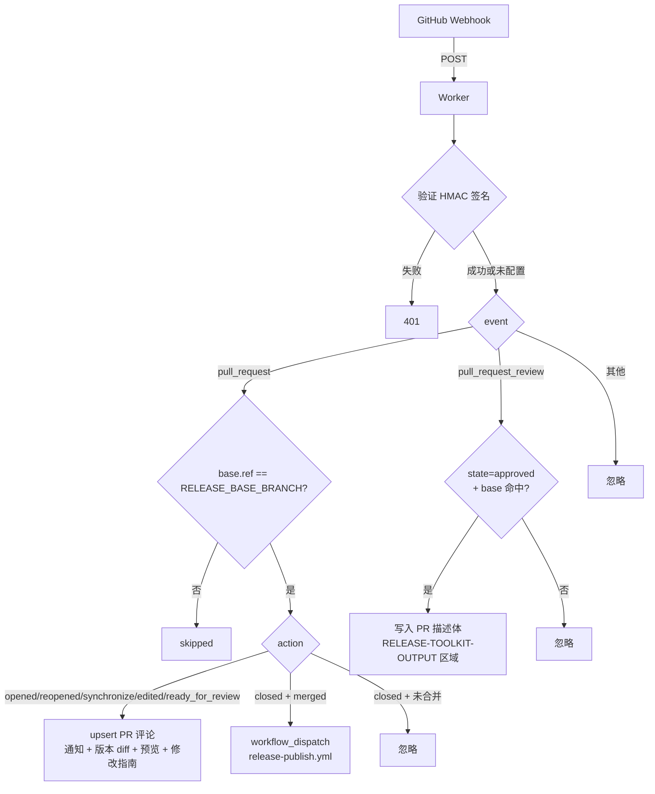

# @release-toolkit/app-server

基于 Cloudflare Workers 的 GitHub App 服务端，负责接收 Webhook，**按目标分支过滤** PR，
在 PR 上 upsert 评论，监听 `pull_request_review.submitted` 自动写入 PR 描述体，
并在合并时通过 `workflow_dispatch` 触发 CI 中的发布 workflow。

## 架构

```
src/
└── index.ts          # 单文件 Worker：fetch handler + 评论/描述体生成 + workflow 触发
```

> 单文件设计避免 Cloudflare Workers 的多文件 bundle 开销，与 `@release-toolkit/core`
> 的 Node-only 模块（`fs`/`simple-git`）解耦。

## 流程



## PR 处理逻辑

| Event | Action | 行为 |
|-------|--------|------|
| `pull_request` | `opened` / `reopened` / `synchronize` / `edited` / `ready_for_review` | upsert PR 评论（通知 + diff + 预览 + 指南） |
| `pull_request` | `closed` (merged) | `workflow_dispatch` 触发 `release-publish.yml` |
| `pull_request_review` | `submitted` + `state=approved` | 写入 PR 描述体 `RELEASE-TOOLKIT-OUTPUT` 区域 |

所有 PR 事件先按 `base.ref === RELEASE_BASE_BRANCH`（默认 `dev`）过滤。

## 评论格式

```markdown
📢 **PR 待审批**

### 变更包版本

| 包名 | 当前版本 | 新版本 |
| --- | --- | --- |
| `@myapp/auth` | 1.0.0 | 1.1.0 |

---

# PR #123 变更日志

## 变更包列表：
- `@myapp/auth`：1.0.0 → 1.1.0

## @myapp/auth
- ✨ feat: 新增登录功能（标题）
- 新增微信登录

---

<details><summary>✏️ 如何修改变更日志</summary>...</details>
```

通过 `OUTPUT_SECTIONS` 环境变量可关闭任一区块。

## 环境变量

| 变量 | 默认 | 说明 |
|------|------|------|
| `GITHUB_APP_ID` | - | GitHub App ID |
| `GITHUB_APP_PRIVATE_KEY` | - | GitHub App PEM 私钥 |
| `GITHUB_WEBHOOK_SECRET` | - | Webhook 签名密钥（缺失时跳过验证，仅供 dev） |
| `RELEASE_BASE_BRANCH` | `dev` | 触发收集/发布的目标分支 |
| `RELEASE_PUBLISH_WORKFLOW` | `release-publish.yml` | merge 后触发的 workflow 文件名 |
| `OUTPUT_SECTIONS` | 全部 `true` | JSON：`{"notification":true,"preview":true,"editGuide":true}` |

## 部署

```bash
pnpm --filter @release-toolkit/app-server build
pnpm --filter @release-toolkit/app-server deploy
```
