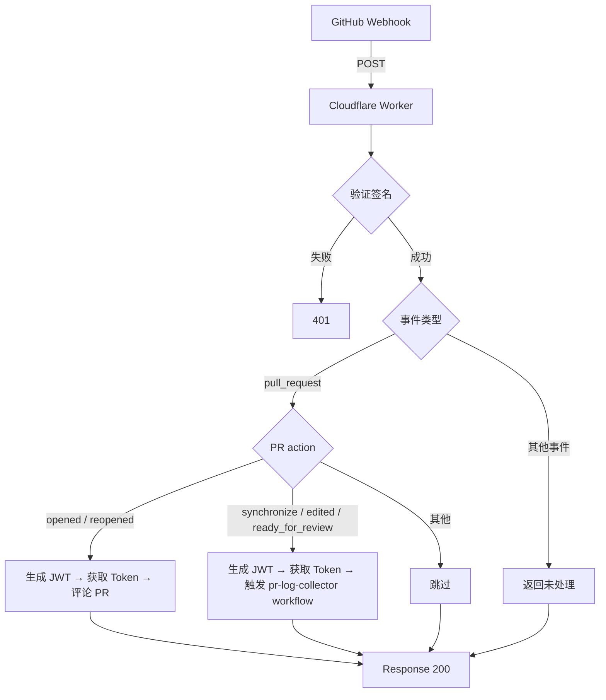

# @release-toolkit/app-server

基于 Cloudflare Workers 的 GitHub App 服务端，接收 Webhook 事件并调用 `@release-toolkit/core` 功能。

## 架构

```
src/
├── index.ts          # Worker 入口，fetch handler + 签名验证
├── handlers/         # 事件处理器
│   └── pr-handler.ts # PR 事件处理
└── utils/            # 工具函数
    ├── crypto.ts     # HMAC 签名验证
    ├── jwt.ts        # GitHub App JWT 生成
    └── http.ts       # GitHub API 请求封装
```

## 流程



## PR 处理逻辑

| Action | 行为 |
|--------|------|
| `opened` / `reopened` | 发送欢迎评论，提醒用户 Approve |
| `synchronize` / `edited` / `ready_for_review` | 调用 `@release-toolkit/core` 收集日志 |
| 其他 | 跳过 |

## 架构优势

- **统一入口**：App Server 直接调用 core，无需 workflow 中转
- **减少延迟**：无需等待 workflow 排队和执行
- **简化配置**：不需要额外的 workflow 文件

## 环境变量

| 变量 | 说明 |
|------|------|
| `GITHUB_APP_ID` | GitHub App ID |
| `GITHUB_WEBHOOK_SECRET` | Webhook 签名密钥 |
| `GITHUB_APP_PRIVATE_KEY` | GitHub App 私钥（PEM 格式） |

## 部署

使用 Wrangler 部署到 Cloudflare Workers：

```bash
# 安装 Wrangler CLI
npm install -g wrangler

# 登录
wrangler login

# 部署
wrangler deploy
```
