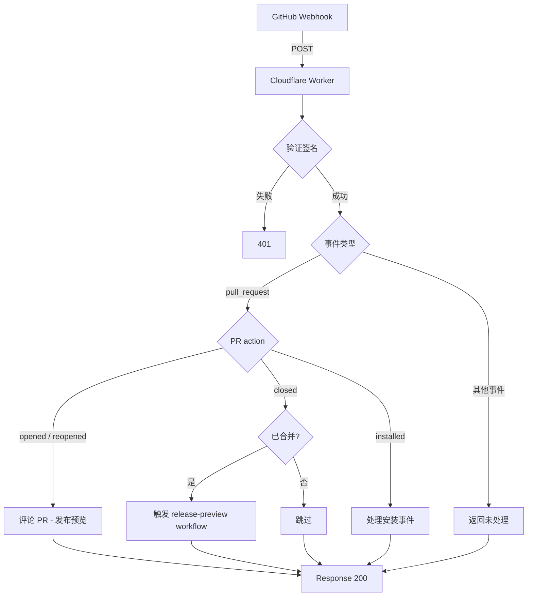

# @release-toolkit/app-server

基于 Cloudflare Workers 的 GitHub App 服务端，接收 Webhook 事件并调用 `@release-toolkit/core` 功能。

## 架构

```
src/
├── index.ts          # Worker 入口，fetch handler + 签名验证
├── handler.ts        # 事件分发处理（PR、Installation 事件）
├── verify.ts         # Webhook 签名验证
├── jwt.ts            # GitHub App JWT 生成
├── github.ts         # GitHub API 调用封装
└── types.ts          # 类型定义
```

## 流程



## PR 处理逻辑

| Action | 行为 |
|--------|------|
| `opened` / `reopened` | 发送发布预览评论 |
| `closed`（已合并） | 触发 release-preview workflow |
| `installed` | 处理 App 安装事件 |
| 其他 | 跳过 |

## 环境变量

| 变量 | 说明 |
|------|------|
| `GITHUB_APP_ID` | GitHub App ID |
| `GITHUB_WEBHOOK_SECRET` | Webhook 签名密钥 |
| `GITHUB_APP_PRIVATE_KEY` | GitHub App 私钥（PEM 格式） |
| `GITHUB_WORKFLOW_ID` | 要触发的 workflow ID |
| `GITHUB_OWNER` | 仓库所有者 |
| `GITHUB_REPO` | 仓库名称 |

## 部署

使用 Wrangler 部署到 Cloudflare Workers：

```bash
# 安装 Wrangler CLI
npm install -g wrangler

# 登录
wrangler login

# 部署
cd packages/app-server
pnpm run deploy
```

## 本地开发

```bash
cd packages/app-server
pnpm run dev
```
