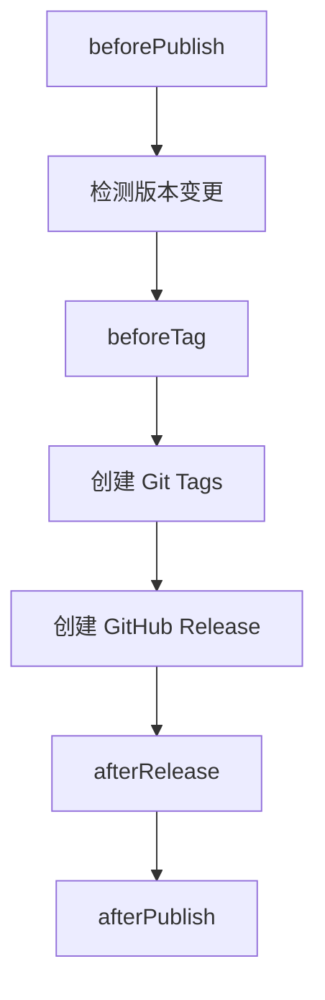

# @release-toolkit/core

核心库：版本检测、Changelog 引擎、插件系统、钩子系统。

## 架构

```
src/
├── shared/                # 共享模块
│   ├── config/            # 配置加载
│   ├── git/               # Git 操作（diff、tag、push）
│   ├── github/            # GitHub API（PR 评论、上下文检测）
│   ├── plugins/           # 插件系统（加载、格式化）
│   ├── hook-runner.ts     # 钩子执行器
│   ├── types.ts           # 全局类型定义
│   └── index.ts
└── features/              # 功能模块
    ├── pr-log-collector/  # PR 日志收集
    ├── release-preview/   # 发布预览
    └── release-publisher/ # 发布执行（含钩子）
```

## 模块导出

| 模块 | 功能 |
|------|------|
| `prLogCollector` | 提取 PR 标题/评论，更新描述体，保存快照 |
| `releasePreview` | 检测版本变更，聚合日志生成预览 |
| `releasePublisher` | 创建 GitHub Release + 执行钩子 |
| `config` | 加载 `.release-toolkit/config.json` |
| `plugins` | 插件加载与格式化器 |
| `shared/hook-runner.ts` | 插件生命周期钩子调度器（`HookRunner`） |
| `features/release-publisher/hook-runner.ts` | 发布钩子执行器（command / script / package） |
| `github` | GitHub API 封装 |
| `git` | Git 命令封装 |

## 钩子系统

### releasePublisher 钩子流程



### 配置方式

```json
{
  "releasePublisher": {
    "beforeTag": [{ "type": "command", "command": "pnpm build" }],
    "afterRelease": [{ "type": "command", "command": "pnpm -r publish" }]
  }
}
```

### 执行方式

| 类型 | 说明 |
|------|------|
| `command` | Shell 命令 |
| `script` | 项目脚本文件 |
| `package` | npm 包 |
